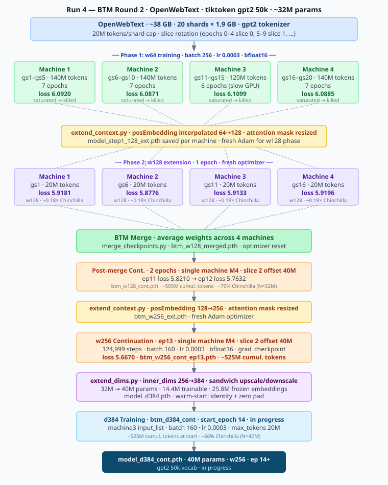

# Transformer Model Experiments - Running Notes

## Run 5 — Progressive Cold-Start: 256→384→512→640→768→896→1024 (Jun 1, 2026)

### Goal
Clean baseline run with correct progressive expansion throughout. Eliminates the `extend_dims.py` bug that compromised Run 4 from the 384→512 stage onward. Each stage trained to Chinchilla 100% before expanding.

### Architecture
| Parameter | Value |
|---|---|
| vecDims | 256 (frozen embedding/output throughout) |
| num_heads | 4 |
| num_layers | 8 |
| window_size | 256 |
| tiktoken | gpt2 (50,257 vocab) |
| data | All 20 OpenWebText shards, all 4 machines (~9.1B tokens) |
| stride | 256 (20M tokens/epoch) |
| lr | 0.0003, no schedule |
| float | bfloat16 |

### Stage Plan

LR scaled linearly with batch size (linear scaling rule, reference: batch=512 → lr=0.0003).

| Stage | inner_dims | N (params) | Chinchilla 100% | Epochs | batch | lr |
|---|---|---|---|---|---|---|
| d256 | 256 | ~32M | 640M tokens | 32 | 512 | 0.000300 |
| d384 | 384 | ~40M | 800M tokens | 40 | 384 | 0.000225 |
| d512 | 512 | ~51M | 1,020M tokens | 51 | 256 | 0.000150 |
| d640 | 640 | ~66M | 1,310M tokens | 66 | 160 | 0.000094 |
| d768 | 768 | ~83M | 1,660M tokens | 83 | 128 | 0.000075 |
| d896 | 896 | ~103M | 2,070M tokens | 104 | 96 | 0.000056 |
| d1024 | 1024 | ~127M | 2,540M tokens | 127 | 64 | 0.000038 |

Total: 507 epochs across all stages. Data covers d1024 Chinchilla (2,540M < 9.1B available).

### Expansion Strategy — extend_dims_sigma.py
SVD sigma-based diagonal noise. For each weight matrix W:
- Old weights preserved exactly in top-left block (rotations intact)
- New-new diagonal: `0.01 × median(σ)` of source matrix — noise proportional to spectral scale
- Cross blocks (old×new, new×old): zero
- Upscale/downscale: carry trained rows/cols, zeros for new dims
- Epoch counter reset to 0 on each expansion (each stage starts from epoch 1)

```bash
python extend_dims_sigma.py input.pth output.pth <inner_dims>
python extend_dims_sigma.py input.pth output.pth <inner_dims> --keep-epoch  # preserve epoch number
```

### Checkpoint Architecture
Every 5 epochs the trainer saves a model-only checkpoint (no optimizer state) to a fixed shared directory. This is what the orchestration script uses to extend between stages.

```
runs/progressive/
  checkpoint/model.pth    ← overwritten every 5 epochs (model state only)
  entropy.csv             ← spectral entropy appended every 5 epochs
```

The main run directory (timestamped) still saves the full checkpoint (model + optimizer) every epoch for resume capability within a stage.

### Entropy Tracking — analyze_checkpoints.py
Every 5 epochs, launched as a non-blocking subprocess by the trainer:
```bash
python analyze_checkpoints.py --extract-single runs/progressive/checkpoint/model.pth \
    --epoch <N> --output-csv runs/progressive/entropy.csv
```
Appends one row per call: `epoch, ffn_up_L0..L7, ffn_dn_L0..L7, wo_L0..L7, q/k/v_L{l}_h{h}`.

### Orchestration — run_progressive.sh

```bash
# Full run from scratch
bash run_progressive.sh

# Skip completed stages, extend to d512 and train fresh
bash run_progressive.sh --start-from d512

# Resume interrupted d512 run from shared checkpoint (no re-extend)
bash run_progressive.sh --start-from d512 --no-extend

# Resume with explicit epoch override
bash run_progressive.sh --start-from d512 --no-extend --resume-epoch 23
```

### runs.toml Profiles
One profile per stage: `progressive_d256`, `progressive_d384`, `progressive_d512`, `progressive_d640`, `progressive_d768`, `progressive_d896`, `progressive_d1024`.

### Scripts Summary
| Script | Purpose |
|---|---|
| `run_progressive.sh` | Top-level orchestration — runs all stages sequentially |
| `extend_dims_sigma.py` | Expansion: SVD sigma noise, correct inner_dims detection |
| `extend_dims.py` | Expansion: diagonal noise (bug-fixed Jun 1, 2026) |
| `extend_dims_svd.py` | Expansion: block-diagonal SVD (exact ×2 only) |
| `analyze_checkpoints.py` | Matrix analysis + `--extract-single` entropy CSV mode |

### Loss Log

| Stage | Epoch | Loss | Notes |
|---|---|---|---|

---

## Run 4 — BTM Round 2: tiktoken gpt2 50k, w64, ~32M params, 4 machines (May 19, 2026)

### Goal
Smaller model (32M) with a better Chinchilla ratio vs Run 3 (76M, word_tokenize).

### Tokenizer change from Run 3
| | Run 3 | Run 4 |
|---|---|---|
| Tokenizer | word_tokenize + Counter | tiktoken gpt2 |
| Vocab size | 50,000 (capped frequency) | 50,257 (fixed BPE) |
| Total params (initial) | ~76M | ~32M |
| Total params (current, d512) | — | ~51M |
| Total params (final planned, d768) | — | ~83M |

Note: cl100k_base (128M) was attempted first and aborted — loss diverged (7.47→8.03 over first shard) with lr=0.0006, and cache files (~3.4 GB each) filled 16 GB disks on all machines.

### Parameter breakdown by expansion stage

| Stage | inner_dims | Frozen (embed+out) | Trainable (core) | Total | head_dim | Batch (12GB) |
|---|---|---|---|---|---|---|
| w64/w256 baseline | 256 | — | ~32M | ~32M | 64 | 256 |
| d384 | 384 | 25.8M | ~14.4M | ~40M | 96 | 256 |
| d512 (current) | 512 | 25.8M | ~25.5M | ~51M | 128 | 256 |
| d640 (planned) | 640 | 25.8M | ~39.6M | ~65M | 160 | 160 |
| d768 (final) | 768 | 25.8M | ~57.0M | ~83M | 192 | 128 |

Frozen = embedding (12.9M) + output projection (12.9M); constant across all stages. Baseline has no upscale/downscale (vecDims=inner_dims=256). Core trainable params scale as 96×inner_dims² (8 layers, attention+FFN). d768 is the stopping point for this experiment.

### Chinchilla ratio
Hoffmann et al. (2022) explicitly counts embedding matrices in N ("Note that we also count embeddings matrices in the total parameter count" — Appendix F). This differs from Kaplan (2020) who used non-embedding parameters; this distinction partly explains the different scaling coefficients between the two papers.

| | 128M attempt | 32M final |
|---|---|---|
| Total params (Chinchilla N) | 128M | 32M |
| Tokens per machine | 100M (5 epochs) | 400M (20 epochs) |
| Tokens / Params ratio | 0.78× | 12.5× |
| Chinchilla optimal (20× total params) | — | **640M tokens** |

> **Note:** Chinchilla's 20× was derived from models ≥70M params — applicability at 32M is uncertain. Also, 25.8M of 32M params here are the embedding table; the transformer core is only ~6M params.

### Config (btm_w64 profile)
| Parameter | Value |
|-----------|-------|
| vecDims | 256 |
| num_heads | 4 |
| num_layers | 8 |
| window_size | 64 |
| batch_size | 256 |
| lr | 0.0003 |
| float_type | bfloat16 |
| grad_checkpoint | false |
| tiktoken_encoding | gpt2 |
| max_tokens | 20,000,000 |
| epochs | 20 per machine |
| optimizer | adam |

### Data
| Field | Value |
|-------|-------|
| Source | OpenWebText (full, ~38 GB) |
| Total shards | 20 |
| Shard naming | gs{N}_m{M}_s{S}.txt (N=global 1–20, M=machine 1–4, S=within-machine 1–5) |
| Raw shard size | 1.9 GB each |
| Tokens per shard (full) | ~457M (gpt2 tokenizer) |
| max_tokens cap | 20,000,000 per shard per epoch |
| Slice rotation | epochs 0–4 → slice 0, 5–9 → slice 1, 10–14 → slice 2, 15–19 → slice 3 |
| Unique tokens per machine | 4 slices × 5 shards × 20M = 400M |
| Total unique tokens across 4 machines | 1.6B |
| Steps per shard epoch (batch=256) | ~78,125 |

### Machines
| Machine | Host | Port | Shards |
|---------|------|------|--------|
| 1 | 74.48.78.46 | 61077 | gs1–gs5 |
| 2 | 61.228.34.3 | 31302 | gs6–gs10 |
| 3 | 82.65.196.171 | 40095 | gs11–gs15 (replacement — original power-capped at 180W) |
| 4 | 207.102.87.207 | 52853 | gs16–gs20 |

### Primary Hypothesis: Progressive Inner-Dimension Expansion

Train a small model with a large number of tokens — deliberately past the Chinchilla-optimal point, or until saturation. Expand the inner transformer dimension (keeping embedding and output projection frozen) and continue training. The claim: smaller models trained beyond Chinchilla develop compact, general representations. Expanding the inner dimension at that point allows the model to build capacity on top of those representations rather than learning them from scratch.

Trigger for expansion: ~70–80% of Chinchilla-optimal token count for the current N, or observed loss saturation — whichever comes first.

The frozen embedding and output projection are the bridge: they carry the learned token semantics across expansions. The transformer core grows; the vocabulary interface stays fixed. Each expansion resets the Chinchilla ratio downward (larger N → larger optimal token budget), buying several more epochs of useful training before the next expansion.

This is a practical strategy for consumer hardware. A model that would not fit in VRAM from scratch can be reached by training a small model that fits, then expanding progressively. The total compute is spread across smaller models at each stage, all of which fit within the VRAM budget.

### Secondary Hypothesis: Context-Length Scaling
Inspired by *Intrinsic Entropy of Context Length Scaling in LLMs*. Train at a short context until near saturation, then interpolate to a longer window and continue with fresh data. Context length grows roughly in proportion to unique tokens seen — the model earns longer context by first learning well at a shorter one. Each interpolation step is triggered by observed loss saturation, not a fixed schedule.

### Chinchilla Ratio Progression

| Stage | Window | N (params) | Chinchilla optimal | Tokens seen | Chinchilla % |
|---|---|---|---|---|---|
| w64 saturate | 64 | 32M | 640M | ~405M | ~63% |
| w128 branch + merge | 128 | 32M | 640M | ~465M | ~73% |
| w128 post-merge ep12 | 128 | 32M | 640M | ~505M | ~79% |
| w256 ep13 | 256 | 32M | 640M | ~525M | ~82% |
| extend_dims 256→384 | — | 32M→40M | 640M→800M | ~525M | ~66% ↓ |
| d384 ep14 | 256 | 40M | 800M | ~545M | ~68% |
| extend_dims 384→512 | — | 40M→51M | 800M→1,020M | ~545M | ~53% ↓ |
| d512 ep15 | 256 | 51M | 1,020M | ~565M | ~55% |
| d512 ep16 (local) | 256 | 51M | 1,020M | ~585M | ~57% |
| d512 ep17 (local) | 256 | 51M | 1,020M | ~605M | ~59% |
| d512 ep18 (local) | 256 | 51M | 1,020M | ~625M | ~61% |
| d512 ep19 (local) | 256 | 51M | 1,020M | ~645M | ~63% |
| d512 ep20 (local) | 256 | 51M | 1,020M | ~665M | ~65% |
| d512 ep21 (local, stride=1) | 256 | 51M | 1,020M | ~685M | ~67% |
| d512 ep21 stride128 | 256 | 51M | 1,020M | ~705M | ~69% |
| d512 ep22 stride128 | 256 | 51M | 1,020M | ~725M | ~71% |
| d512 ep23 stride128 | 256 | 51M | 1,020M | ~745M | ~73% |
| d512 ep24 stride128 | 256 | 51M | 1,020M | ~765M | ~75% |
| d512 ep25 stride128 | 256 | 51M | 1,020M | ~785M | ~77% |
| d512 ep26 stride128 | 256 | 51M | 1,020M | ~805M | ~79% |
| d512 ep27 stride128 | 256 | 51M | 1,020M | ~825M | ~81% |
| d512 ep28 stride128 | 256 | 51M | 1,020M | ~845M | ~83% |
| d512 ep29 stride128 | 256 | 51M | 1,020M | ~865M | ~85% |
| d512 ep30 stride128 | 256 | 51M | 1,020M | ~885M | ~87% |
| extend_dims 512→1024 | — | 51M→127M | 1,020M→2,540M | ~885M | ~34.8% ↓ |

### Checkpoints — Run 4


All local paths relative to `transformer/`. `opt` = includes Adam optimizer state. Server = M4 (207.102.87.207), code root `/root/transformer/`.

| Phase | Epoch | Loss | Local path | Size | opt | Notes |
|---|---|---|---|---|---|---|
| w64 final M1 | 7 | 6.0920 | `btm_r2_backups/model_step1_128_m1.pth` | 184M | ✓ | saturated |
| w64 final M2 | 7 | 6.0871 | `btm_r2_backups/model_step1_128_m2.pth` | 184M | ✓ | saturated |
| w64 final M3 | 6 | 6.1099 | `btm_r2_backups/model_step1_128_m3.pth` | 184M | ✓ | 180W cap, stopped ep6 |
| w64 final M4 | 7 | 6.0885 | `btm_r2_backups/model_step1_128_m4.pth` | 184M | ✓ | saturated |
| w64 ext M3 | 7 | — | `btm_r2_backups/model_step1_128_ext_m3.pth` | 62M | ✗ | posEmbed 64→128 interpolated; only M3 copy local |
| w128 branch M1 | 1 | 5.9181 | `btm_r2_backups/model_w128_m1.pth` | 185M | ✓ | |
| w128 branch M2 | 1 | 5.8776 | `btm_r2_backups/model_w128_m2.pth` | 185M | ✓ | |
| w128 branch M3 | 1 | 5.9133 | `btm_r2_backups/model_w128_m3.pth` | 185M | ✓ | |
| w128 branch M4 | 1 | 5.9196 | `btm_r2_backups/model_w128_m4.pth` | 185M | ✓ | |
| BTM merge | — | — | `btm_r2_backups/btm_w128_merged.pth` | 124M | ✗ | avg of 4 w128 branches |
| w128 cont | 12 | 5.7632 | `btm_r2_backups/btm_w128_cont.pth` | 185M | ✓ | post-merge ep11–12 on M4 |
| w256 cont | 13 | 5.6670 | `btm_r2_backups/btm_w256_cont_ep13.pth` | 185M | ✓ | server: `runs/btm_w256_cont_20260521_054026/model.pth` |
| d384 ep14 | 14 | 5.7343 | — | — | — | server only: `runs/btm_d384_cont_20260521_142729/model.pth` |
| d512 ep15 (unfused) | 15 | 5.7338 | `btm_r2_backups/d512_20260522/btm_d512_cont_20260522_203334/model.pth` | 196M | ✓ | |
| d512 ep15 (fused) | 15 | 5.7338 | `btm_r2_backups/d512_20260522/btm_d512_cont_20260522_203334/model_fused.pth` | 99M | ✗ | fused QKV, cold optimizer; SDPA ep16 starting point |
| d512 ep16 (SDPA) | 16 | 5.1473 | `runs/btm_d512_cont_local_20260527_070826/model.pth` | 196M | ✓ | |
| d512 ep18 (SDPA) | 18 | 4.9953 | `runs/btm_d512_cont_local_20260527_203054/model.pth` | 196M | ✓ | |
| d512 ep19 (SDPA) | 19 | 5.0129 | `runs/btm_d512_cont_local_20260528_223411/model.pth` | 196M | ✓ | Wo surgery applied → model_wo_repaired.pth |
| d512 ep20 (SDPA) | 20 | 4.9336 | `btm_r2_backups/d512_ep20_sdpa.pth` | 196M | ✓ | post-surgery; run dir: btm_d512_cont_local_20260529_181714 |

### Actual training approach (decided mid-run)
All machines saturated at ~6.09 after 6-8 epochs. Decision: stop early, extend context, merge.

1. **w64 phase** — train until saturation (~6-8 epochs per machine)
2. **extend_context.py** — interpolate posEmbedding 64→128 per machine, resize attention mask
3. **w128 phase** — 1 epoch per machine, fresh optimizer
4. **BTM merge** — average weights across 4 machines → `btm_w128_merged.pth`
5. **Post-merge continuation** — 2 epochs on single machine (M4), slice 2 offset 40M → ep11 loss 5.8210, ep12 loss 5.7632
6. **extend_context.py** — interpolate posEmbedding 128→256, resize masks → `btm_w256_ext.pth`
7. **w256 phase** — ep13 single machine (M4), slice 2 offset 40M, 124,999 batches → loss 5.6670
8. **extend_dims.py** — inner transformer dimension 256→384, embeddings frozen, N: 32M→40M → `model_d384.pth`
9. **d384 ep14** — btm_d384_cont profile, machine3 input_list, 1 epoch → loss 5.7343 — killed
10. **d384 cold start** — btm_d384_cont profile, no pretrained weights, same input_list — control vs d384 warm-start
11. **extend_dims.py** — inner transformer dimension 384→512, N: 40M→51M → `model_d512.pth` (from d384 ep14 checkpoint)
12. **d512 ep15** — btm_d512_cont profile, machine3 input_list, from model_d512.pth — in progress
13. **d384 ep15 cont** — btm_d384_cont profile, continuing from d384 ep14 checkpoint — killed, superseded by d512
14. **d512 ep16–19 (local)** — btm_d512_cont_local, machine3 gs11–gs14 slice 3, batch=256 — ep19 final 5.0129; Wo surgery applied to ep19 checkpoint
15. **d512 ep20–21 (local)** — btm_d512_cont_local, post-Wo repair, batch=512, stride=1 — ep21 loss 4.9207
16. **d512 stride128 continuation** — btm_d512_cont_local, `data_stride=128`, 306 batches/epoch — ep21 loss 4.9000, ep22 loss 5.1286
17. **d512 stride128 ep23–30** — planned continuation to ~885M counted tokens
18. **extend_dims 512→640** — planned after ep30; head_dim=160; ~65M params; batch=160 on 12GB
19. **d640 continuation** — planned; train until saturation or ~70-80% Chinchilla
20. **extend_dims 640→768** — planned; head_dim=192; ~83M params; batch=128 on 12GB
21. **d768 continuation** — planned; final stage for this experiment
22. **context interpolation** — deferred (outside scope of this experiment)

### Loss Log
| | Machine 1 | Machine 2 | Machine 3 | Machine 4 |
|---|---|---|---|---|
| Shards | gs1–gs5 | gs6–gs10 | gs11–gs15 | gs16–gs20 |
| **w64 epochs done** | 7 | 7 | 6 (slow machine) | 7 |
| Epoch 1 loss | 6.4417 | — | — | — |
| Epoch 2 loss | 6.2867 | — | — | — |
| Epoch 3 loss | 6.1760 | — | — | — |
| Epoch 4 loss | 6.1506 | 6.1520 | 6.1616 | — |
| Epoch 5 loss | 6.1463 | 6.1269 | 6.1312 | 6.1323 |
| Epoch 6 loss | 6.1165 | 6.1180 | 6.1099 ← final | 6.1026 |
| Epoch 7 loss | 6.0920 ← final | 6.0871 ← final | — | 6.0885 ← final |
| **w128 epoch loss** | **5.9181** | **5.8776** | **5.9133** | **5.9196** |
| **BTM merge** | btm_w128_merged.pth (average of 4) | | | |
| Post-merge ep11 (M4 only) | 5.8210 | | | |
| Post-merge ep12 (M4 only) | **5.7632 ← final** | | | |

### Loss Log — w128 Continuation (ep11–12, May 20–21, 2026)

**Epoch 11 loss log** (btm_w128_cont_20260520_152459, 78,125 steps)
| Checkpoint | Batch | Loss |
|------------|-------|------|
| 10% | 7,812 | 5.9943 |
| 20% | 15,624 | 5.9308 |
| 30% | 23,436 | 5.8991 |
| 40% | 31,248 | 5.8788 |
| 50% | 39,060 | 5.8638 |
| 60% | 46,872 | 5.8522 |
| 70% | 54,684 | 5.8426 |
| 80% | 62,496 | 5.8344 |
| 90% | 70,308 | 5.8273 |
| 100% | 78,120 | 5.8211 |
| **Epoch 11 final** | — | **5.8210** |

**Epoch 12 loss log** (btm_w128_cont_20260520_235903, 78,125 steps)
| Checkpoint | Batch | Loss |
|------------|-------|------|
| 10% | 7,812 | 5.8077 |
| 20% | 15,624 | 5.7975 |
| 30% | 23,436 | 5.7909 |
| 40% | 31,248 | 5.7851 |
| 50% | 39,060 | 5.7804 |
| 60% | 46,872 | 5.7763 |
| 70% | 54,684 | 5.7727 |
| 80% | 62,496 | 5.7692 |
| 90% | 70,308 | 5.7661 |
| 100% | 78,120 | 5.7632 |
| **Epoch 12 final** | — | **5.7632** |

### Loss Log — w256 Continuation (ep13, May 21, 2026)

**Setup**
| Parameter | Value |
|-----------|-------|
| Starting checkpoint | btm_w256_ext.pth (extend_context 128→256 from btm_w128_cont.pth) |
| Machine | M4 server (207.102.87.207) |
| input_list | machine3 shards (gs12–gs15, slice 2 offset 40M) |
| window_size | 256 |
| float_type | bfloat16 |
| grad_checkpoint | yes |
| Steps/epoch | 124,999 |

**Epoch 13 loss log**
| Checkpoint | Loss |
|------------|------|
| 10% | 5.7935 |
| 20% | 5.7396 |
| 30% | 5.7166 |
| 40% | 5.7029 |
| 50% | 5.6933 |
| 60% | 5.6858 |
| 70% | 5.6799 |
| 80% | 5.6749 |
| 90% | 5.6706 |
| **100%** | **5.6670** |

LR held constant at 0.000300. Steady descent throughout.

---

### Inner Dimension Expansion — d384 (May 21, 2026)

**Architecture change**

Transformer core expanded 256→384 inner dims using a sandwich approach:
- Frozen embedding [V, 256] and output projection [V, 256] remain untouched
- Trainable upscale Linear[256→384] inserted after embedding lookup
- Transformer blocks operate at 384 dims (8 layers, 4 heads, head_dim=96)
- Trainable downscale Linear[384→256] inserted before output projection

Warm-start: identity in the first 256×256 block, zeros elsewhere — preserves existing representations at init.

| | Before | After |
|--|--|--|
| Inner dims | 256 | 384 |
| Total params | ~32M | ~40M |
| Trainable params | ~32M | ~14.4M |
| Frozen params | 0 | ~25.8M |
| Chinchilla N | 32M | 40M |
| Chinchilla optimal | 640M | 800M |
| Chinchilla % at ep13 end | ~82% | ~66% |

Script: `extend_dims.py` run on server, output `model_d384.pth` (185 MB), epoch tag preserved as 13.

**Training setup (btm_d384_cont profile)**
| Parameter | Value |
|-----------|-------|
| Starting checkpoint | model_d384.pth (ep13, loss 5.6670) |
| start_epoch | 14 |
| vecDims | 256 |
| inner_dims | 384 |
| window_size | 256 |
| batch_size | 160 |
| lr | 0.0003 |
| float_type | bfloat16 |
| grad_checkpoint | yes |
| max_tokens | 20,000,000 |
| input_list | machine3 (gs12–gs15, slice 2 offset 40M) |

**Loss Log — ep14 (May 22, 2026)**

| Step | Checkpoint | Loss |
|------|------------|------|
| ~3,250 | 2.6% | 6.5000 |
| 12,499 | 10% | 6.1643 |
| 24,998 | 20% | 5.9641 |
| 37,497 | 30% | 5.8832 |
| 49,996 | 40% | 5.8373 |
| 62,495 | 50% | 5.8071 |
| 74,994 | 60% | 5.7852 |
| 87,493 | 70% | 5.7685 |
| 99,992 | 80% | 5.7550 |
| 112,491 | 90% | 5.7438 |
| 124,990 | 100% | **5.7343** |

---

### d384 Cold Start — Control Run (May 22, 2026)

d384 architecture (inner_dims=384, 40M params) trained from random init on same data as the warm-started d384. Goal: isolate how much of the warm-start's loss curve is due to architecture capacity vs pre-training.

| Parameter | Value |
|-----------|-------|
| Starting checkpoint | none (random init) |
| Profile | btm_d384_cont |
| vecDims | 256 |
| inner_dims | 384 |
| window_size | 256 |
| batch_size | 160 |
| lr | 0.0003 |
| float_type | bfloat16 |
| grad_checkpoint | yes |
| max_tokens | 20,000,000 |
| input_list | machine3 (gs12–gs15, slice 2 offset 40M) |

**Loss Log — ep1**

| Checkpoint | Batch | Loss |
|------------|-------|------|
| 10% | 12,499 | 8.5458 |
| 20% | 24,998 | 8.3711 |
| 30% | 37,497 | 8.2823 |
| 40% | 49,996 | 8.2225 |
| 50% | 62,495 | 8.1774 |
| 60% | 74,994 | 8.1407 |
| 70% | 87,493 | 8.1100 |
| 80% | 99,992 | 8.0834 |
| 90% | 112,491 | 8.0599 |
| 100% | 124,990 | 8.0388 |
| **Epoch 1 final** | — | **8.0388** |

---

### d512 Continuation — ep15 (May 22, 2026)

| Parameter | Value |
|-----------|-------|
| Starting checkpoint | model_d512.pth (extend_dims 384→512 from d384 ep14, loss 5.7343) |
| Profile | btm_d512_cont |
| inner_dims | 512 |
| batch_size | 1280 |
| Steps/epoch | 15,625 |
| input_list | machine3 (gs12–gs15, slice 2 offset 40M) |

**Local backup**: `btm_r2_backups/d512_20260522/btm_d512_cont_20260522_203334/model.pth`

**Loss Log — ep15**

| Checkpoint | Batch | Loss |
|------------|-------|------|
| 10% | 1,562 | 6.4423 |
| 20% | 3,124 | 6.1993 |
| 30% | 4,686 | 6.0597 |
| 40% | 6,248 | 5.9673 |
| 50% | 7,810 | 5.9022 |
| 60% | 9,372 | 5.8532 |
| 70% | 10,934 | 5.8146 |
| 80% | 12,496 | 5.7828 |
| 90% | 14,058 | 5.7565 |
| **100%** | **15,620** | **5.7338** |

---

### d512 Local Continuation — ep16 (May 23, 2026)

| Parameter | Value |
|-----------|-------|
| Starting checkpoint | btm_r2_backups/d512_20260522/btm_d512_cont_20260522_203334/model.pth (ep15, loss 5.7338) |
| Profile | btm_d512_cont_local |
| inner_dims | 512 |
| batch_size | 256 |
| Steps/epoch | 78,124 |
| Rate | ~1.43 steps/sec, ~15 hr/epoch |
| Data | gs11_m3_s1.txt, slice 3, offset 60M (fresh — not seen by server) |
| input_list | machine3 5-shard cycling (gs11–gs15) |

**Loss Log — ep16**

| Checkpoint | Batch | Loss |
|------------|-------|------|
| 10% | 7,812 | 5.5375 |
| 20% | 15,624 | 5.5183 |
| 30% | 23,436 | 5.5055 |
| 40% | 31,248 | 5.4961 |
| 50% | 39,060 | 5.4885 |
| 60% | 46,872 | 5.4822 |
| 70% | 54,684 | 5.4768 |
| 80% | 62,496 | 5.4721 |
| 90% | 70,308 | 5.4679 |
| **100%** | **78,120** | **5.4640** |

**Loss Log — ep17** (data: gs12_m3_s2.txt, slice 3 offset 60M)

| Checkpoint | Batch | Loss |
|------------|-------|------|
| 10% | 7,812 | 5.5100 |
| 20% | 15,624 | 5.4968 |
| 30% | 23,436 | 5.4885 |
| 40% | 31,248 | 5.4823 |
| 50% | 39,060 | 5.4771 |
| 60% | 46,872 | 5.4727 |
| 70% | 54,684 | 5.4689 |
| 80% | 62,496 | 5.4655 |
| 90% | 70,308 | 5.4624 |
| **100%** | **78,120** | **5.4596** |

**Loss Log — ep18** (data: gs13_m3_s3.txt, slice 3 offset 60M)

| Checkpoint | Batch | Loss |
|------------|-------|------|
| 10% | 7,812 | 5.4939 |
| 20% | 15,624 | 5.4827 |
| 30% | 23,436 | 5.4749 |
| 40% | 31,248 | 5.4693 |
| 50% | 39,060 | 5.4649 |
| 60% | 46,872 | 5.4610 |
| 70% | 54,684 | 5.4577 |
| 80% | 62,496 | 5.4547 |
| 90% | 70,308 | 5.4520 |
| **100%** | **78,120** | **5.4495** |

**Loss Log — ep19** (data: gs14_m3_s4.txt, slice 3 offset 60M, in progress)

| Checkpoint | Batch | Loss |
|------------|-------|------|
| 10% | 7,812 | 5.4850 |
| 20% | 15,624 | 5.4747 |
| 30% | 23,436 | 5.4683 |
| 40% | 31,248 | 5.4636 |
| 50% | 39,060 | 5.4596 |
| 60% | 46,872 | 5.4562 |
| 70% | 54,684 | 5.4535 |
| 80% | 62,496 | 5.4510 |
| 90% | 70,308 | 5.4487 |
| **100%** | **78,120** | **5.4465** |

ep19 final: 5.4465. Run continued to ep20 without saving ep19 model.pth (save was outside epoch loop — bug). ep19 weights not recoverable.

---

### Code Changes — May 26, 2026

| Change | Detail |
|---|---|
| QKV | Fused: single `[innerDims, 3*innerDims]` param replaces 3×`[num_heads, innerDims, head_dim]` |
| Attention | F.scaled_dot_product_attention, is_causal=True (PyTorch 2.10 built-in) |
| Optimizer | Adam, eps=1e-4 |
| Checkpoint conversion | convert_unfused_to_fused.py: permute+reshape keys/query/value → qkv; optimizer state dropped |
| VRAM (batch=256, d512, bfloat16) | ~9.6GB → 5.7GB after fused+flash_attn |

Tried `permute(2,0,1,3,4).contiguous()` before flash_attn_func to fix seqlen stride (`3·H·head_dim` → `H·head_dim` on `qkv[:,:,0]` slice); loss ~6-7 at 10%, climbed to 14+ by ~80% — not the root cause. flash_attn_func v2.8.3 backward on RTX 5070 (sm_120) identified as potential cause; replaced with F.scaled_dot_product_attention (May 27); ep16 rerun stable, 5.62 at 9.5%.

---

### d512 ep16 Rerun — SDPA (May 27, 2026)

Starting checkpoint: `btm_r2_backups/d512_20260522/btm_d512_cont_20260522_203334/model_fused.pth` (ep15, loss 5.7338, fused QKV, cold optimizer)

| Parameter | Value |
|---|---|
| Attention | F.scaled_dot_product_attention |
| batch_size | 512 |
| lr | 0.0009 |
| lr_schedule | plateau |
| optimizer | Adam, eps=1e-4 |

| Checkpoint | Batch | Loss |
|---|---|---|
| 10% | 3,906 | 5.6178 |
| 20% | 7,812 | 5.4536 |
| 30% | 11,718 | 5.3651 |
| 40% | 15,624 | 5.3070 |
| 50% | 19,530 | 5.2644 |
| 60% | 23,436 | 5.2313 |
| 70% | 27,342 | 5.2046 |
| 80% | 31,248 | 5.1825 |
| 90% | 35,154 | 5.1636 |
| **100%** | **39,060** | **5.1473** |

vs. ep16 unfused (batch=256, lr=0.0006): 5.5375 at 10%, 5.4640 final.

batch=512, lr=0.0009 descending faster than previous ep16. A FastAI-style LR range test before long runs to find the largest stable LR is a worthwhile upfront investment.

---

### d512 ep17 — reset_optimizer_every_epoch=True (May 27, 2026) — killed at 2.5%

Starting checkpoint: `runs/btm_d512_cont_local_20260527_070826/model.pth` (ep16, loss 5.1473)

| Parameter | Value |
|---|---|
| Attention | F.scaled_dot_product_attention |
| batch_size | 512 |
| lr | 0.0009 |
| lr_schedule | plateau |
| optimizer | Adam, eps=1e-4, cold every epoch |
| reset_optimizer_every_epoch | true |
| input_list | all 20 shards (gs1–gs20, 4 machines) |
| data | gs17_m4_s2.txt, slice 3 offset 60M |

| Checkpoint | Batch | Loss |
|---|---|---|
| start | 0 | 8–9 |
| ep17 | ~2.5% | 5.49 |

Killed — above ep16 final (5.1473) at 2.5%; cold v_t too disruptive on fresh data.

---

### d512 ep17 — reset_optimizer_every_epoch=False (May 27, 2026)

Starting checkpoint: `runs/btm_d512_cont_local_20260527_070826/model.pth` (ep16, loss 5.1473)  
Run dir: `btm_d512_cont_local_20260527_203054`

| Parameter | Value |
|---|---|
| Attention | F.scaled_dot_product_attention |
| batch_size | 512 |
| lr | 0.0009 |
| lr_schedule | plateau |
| optimizer | Adam, eps=1e-4, warm (ep16 state loaded) |
| reset_optimizer_every_epoch | false |
| input_list | all 20 shards (gs1–gs20, 4 machines) |
| data | gs17_m4_s2.txt, slice 3 offset 60M |

| Checkpoint | Batch | Loss |
|---|---|---|
| start | 0 | 5.36 |
| 10% | 3,906 | 5.1698 |
| 20% | 7,812 | 5.1327 |
| 30% | 11,718 | 5.1084 |
| 40% | 15,624 | 5.0909 |
| 50% | 19,530 | 5.0768 |
| 60% | 23,436 | 5.0650 |
| 70% | 27,342 | 5.0550 |
| 80% | 31,248 | 5.0463 |
| 90% | 35,154 | 5.0385 |
| **100%** | **39,062** | **5.0315** |

---

### d512 ep18 (May 28, 2026)

Data: gs18_m4_s3.txt, slice 3 offset 60M. Plateau scheduler fired twice during epoch.

| Checkpoint | Batch | Loss | LR |
|---|---|---|---|
| 10% | 3,906 | 5.1333 | 0.000900 |
| 20% | 7,812 | 5.0999 | 0.000900 |
| 30% | 11,718 | 5.0788 | 0.000450 ← halved |
| 40% | 15,624 | 5.0547 | 0.000450 |
| 50% | 19,530 | 5.0385 | 0.000450 |
| 60% | 23,436 | 5.0269 | 0.000225 ← halved |
| 70% | 27,342 | 5.0159 | 0.000225 |
| 80% | 31,248 | 5.0074 | 0.000225 |
| 90% | 35,154 | 5.0008 | 0.000225 |
| **100%** | **39,060** | **4.9953** | 0.000225 |

Plateau scheduler fired at 30% (0.0009→0.00045) and 60% (0.00045→0.000225). Cause: cumulative avg at ep18 start exceeded ep17 final (5.0315) for 2 consecutive heartbeats. Model still improving — scheduler misfired due to cumulative average metric inconsistency across epoch boundaries.

---

### d512 ep19 (May 28–29, 2026)

Data: gs19_m4_s4.txt, slice 3 offset 60M. LR=0.000225 throughout (plateau scheduler carried from ep18, did not fire).

| Checkpoint | Batch | Loss | LR |
|---|---|---|---|
| 10% | 3,906 | 5.1215 | 0.000225 |
| 20% | 7,812 | 5.0921 | 0.000225 |
| 30% | 11,718 | 5.0734 | 0.000225 |
| 40% | 15,624 | 5.0594 | 0.000225 |
| 50% | 19,530 | 5.0483 | 0.000225 |
| 60% | 23,436 | 5.0392 | 0.000225 |
| 70% | 27,342 | 5.0313 | 0.000225 |
| 80% | 31,248 | 5.0244 | 0.000225 |
| 90% | 35,154 | 5.0183 | 0.000225 |
| **100%** | **39,062** | **5.0129** | 0.000225 |

Checkpoint: `runs/btm_d512_cont_local_20260528_223411/model.pth`

---

### Wo SVD Analysis — ep19 checkpoint (May 29, 2026)

SVD computed on all 8 Wo layers [512×512] from ep19 checkpoint.

**Inactive singular directions per layer (before repair)**

| Layer | Total dims | Active (>1e-6) | Inactive (≤1e-6) | Active s_mean | Active s_max |
|---|---|---|---|---|---|
| Wo.0 | 512 | 258 | 254 | 0.8024 | 2.7710 |
| Wo.1 | 512 | 258 | 254 | 0.8741 | 3.2901 |
| Wo.2 | 512 | 258 | 254 | 0.8974 | 3.1036 |
| Wo.3 | 512 | 258 | 254 | 0.8969 | 3.0821 |
| Wo.4 | 512 | 258 | 254 | 0.9000 | 3.0927 |
| Wo.5 | 512 | 258 | 254 | 0.9206 | 3.2047 |
| Wo.6 | 512 | 258 | 254 | 0.9742 | 2.7458 |
| Wo.7 | 512 | 258 | 254 | 1.0353 | 2.4144 |

254/512 singular directions inactive in all layers. Root cause: `extend_dims.py` zero-padded Wo from [256×256] to [512×512]; the new 256 rows/columns were initialised to zero → rank-deficient from day 0. Only 2 directions recovered gradient signal over 4 epochs of training.

**Condition numbers before and after repair**

Repair: inactive singular values (≤1e-6) boosted to 5% of active mean per layer. Applied to `model.pth` → `model_wo_repaired.pth`. Original backed up as `model.pth.bak`.

| Layer | cond before | boost value | s_min after | s_max after | cond after |
|---|---|---|---|---|---|
| Wo.0 | inf | 0.04012 | 0.03884 | 2.7710 | 71 |
| Wo.1 | inf | 0.04370 | 0.04353 | 3.2901 | 76 |
| Wo.2 | inf | 0.04487 | 0.04458 | 3.1037 | 70 |
| Wo.3 | inf | 0.04485 | 0.04459 | 3.0822 | 69 |
| Wo.4 | inf | 0.04500 | 0.04476 | 3.0927 | 69 |
| Wo.5 | inf | 0.04603 | 0.04575 | 3.2047 | 70 |
| Wo.6 | inf | 0.04871 | 0.04839 | 2.7458 | 57 |
| Wo.7 | inf | 0.05177 | 0.05133 | 2.4144 | 47 |

---

### d512 ep20 (May 29, 2026) — in progress

Run dir: `runs/btm_d512_cont_local_20260529_181714/` (power-cut restart; earlier attempt: `20260529_125737`)
Started from: `model_wo_repaired.pth` (ep19, Wo surgery applied)
Data: gs15_m3_s5.txt, slice 4, offset 80,000,000

| Parameter | Value |
|---|---|
| lr | 0.0003 (manual reset, up from 0.000225) |
| lr_schedule | plateau |
| batch_size | 512 |
| start_epoch | 20 |
| steps/epoch | 39,062 |

| Checkpoint | Batch | Loss | LR | Wo inactive | cond>1e5 |
|---|---|---|---|---|---|
| 0.2% | 81 | 5.2252 | 0.000300 | — | — |
| 7.7% | ~3,008 | 5.1096 | 0.000300 | — | — |
| 10% | 3,906 | 5.0933 | 0.000300 | none | none |
| 20% | 7,812 | 5.0460 | 0.000300 | none | Wo.1:1.2e5, Wo.4:1.1e5 |
| 30% | 11,718 | 5.0170 | 0.000300 | none | none |
| 40% | 15,624 | 4.9967 | 0.000300 | none | Wo.0:1.2e5, Wo.1:5.1e5 |
| 50% | 19,530 | 4.9810 | 0.000300 | none | none |
| 60% | 23,436 | 4.9683 | 0.000300 | none | none |
| 70% | 27,342 | 4.9577 | 0.000300 | none | Wo.1:7.8e5, Wo.7:1.3e5 |
| 80% | 31,248 | 4.9486 | 0.000300 | none | none |
| 90% | 35,154 | 4.9407 | 0.000300 | none | none |
| **100%** | **39,060** | **4.9336** | 0.000300 | none | none |

Notes: 0.2% and 7.7% from first attempt (125737); 10–100% from restart (181714). Surgery bump absorbed by 7.7%. Wo condition spikes transient throughout — no dead directions at any point.

### d512 ep21 (May 30, 2026)

Data: cycling from ep20 shard. Plateau LR halved at ~30% (0.000300→0.000150).

| Checkpoint | Batch | Loss | LR | Wo inactive | cond>1e5 |
|---|---|---|---|---|---|
| 10% | 3,906 | 5.0257 | 0.000300 | none | Wo.7:3.9e5 |
| 20% | 7,812 | 4.9930 | 0.000300 | none | Wo.2:2.8e5 |
| 30% | 11,718 | 4.9728 | 0.000150 ← halved | none | Wo.0:1.1e6, Wo.2:3.0e5 |
| 40% | 15,624 | 4.9563 | 0.000150 | none | Wo.0:1.6e5 |
| 50% | 19,530 | 4.9456 | 0.000150 | none | Wo.2:2.2e6, Wo.4:1.1e5, Wo.7:1.6e5 |

### Data stride change — d512 local continuation (May 30, 2026)

Run dir: `runs/btm_d512_cont_local_20260530_185718/`
Starting checkpoint: `runs/btm_d512_cont_local_20260529_181714/model.pth` (saved after epoch 21)

| Parameter | Value |
|---|---|
| data_stride | 128 |
| window_size | 256 |
| batch_size | 512 |
| max_tokens | 20,000,000 |
| dataset windows/epoch | 156,248 |
| batches/epoch | 306 |
| counted tokens/epoch | 20M |
| lr | 0.000150 |
| planned stop | epoch 30 |

`data_stride=128` changes dataset start positions from every token to every 128 tokens. The target remains next-token shifted by +1.

| Epoch | Data | Loss | Elapsed | Notes |
|---|---|---|---|---|
| 21 | gs1_m1_s1.txt, slice 4 offset 80M | 4.9000 | 6.0 min | stride=128 |
| 22 | gs2_m1_s2.txt, slice 4 offset 80M | 5.1286 | 7.5 min | stride=128 |
| 23 | gs3_m1_s3.txt, slice 4 offset 80M | 5.1441 | — | stride=128 |
| 24 | gs4_m1_s4.txt, slice 4 offset 80M | 5.1270 | 8.0 min | stride=128 |
| 25 | gs5_m1_s5.txt | 5.1075 | — | stride=128 |
| 26 | gs6_m2_s1.txt | 5.1003 | — | stride=128 |
| 27 | gs7_m2_s2.txt | 5.0909 | — | stride=128 |
| 28 | gs8_m2_s3.txt | 5.0923 | — | stride=128 |
| 29 | gs9_m2_s4.txt | 5.1000 | — | stride=128 |
| 30 | gs10_m2_s5.txt | 5.0927 | — | stride=128 |

### d1024 ep31+ — btm_d1024_local (May 31, 2026)

Run dir: `runs/btm_d1024_local_20260531_170625/`
Starting checkpoint: `runs/btm_d512_cont_local_20260530_185718/model_d1024_diag2.pth`
init: diagonal noise in true new-new block [512:1024, 512:1024]; upscale/downscale carry trained d512 weights
inner_dims: 512→1024, params: 51M→127M, batch=256, stride=256 (20M tokens/epoch), lr=0.0002

Run dir (ep31–42): `runs/btm_d1024_local_20260531_170625/`
Run dir (ep43+):  `runs/btm_d1024_local_20260531_184831/`  lr_schedule=none, lr=0.0002 fixed

| Epoch | Loss (batch 300/306) | LR | Notes |
|---|---|---|---|
| 31 | ~6.45 | 0.000200 | 8.26→6.58 within epoch; grad_norm 6.4→2.8 |
| 32 | ~5.98 | 0.000200 | |
| 33 | ~5.86 | 0.000200 | |
| 34 | ~5.76 | 0.000200 | |
| 35 | ~5.71 | 0.000200 | |
| 36 | ~5.67 | 0.000200 | |
| 37 | ~5.61 | 0.000200 | |
| 38 | ~5.59 | 0.000050 | plateau fired |
| 39 | ~5.58 | 0.000025 | plateau fired again |
| 40 | ~5.56 | 0.000006 | plateau fired again |
| 41 | ~5.55 | 0.000002 | plateau fired again |
| 42 | ~5.58 | 0.000000 | LR dead; stalled |
| 43 | 5.5293 | 0.000200 | restarted fixed LR, ep42 checkpoint |
| 44 | 5.5505 | 0.000200 | |
| 45 | 5.5366 | 0.000200 | |
| 46 | 5.4968 | 0.000200 | |
| 47 | 5.4861 | 0.000200 | |
| 48 | 5.4830 | 0.000200 | |
| 49 | 5.4579 | 0.000200 | |
| 50 | 5.4481 | 0.000200 | |
| 51 | 5.4399 | 0.000200 | |
| 52 | 5.4302 | 0.000200 | |
| 53 | 5.4103 | 0.000200 | |
| 54 | 5.4050 | 0.000200 | |
| 55 | 5.4010 | 0.000200 | |
| 56 | 5.4022 | 0.000200 | oscillating ~5.40 |

### VRAM profile (batch=256, w128, bfloat16, no grad_checkpoint)
Observed 19 GB peak on training run. Main contributors:
| Component | Size |
|---|---|
| Model params (bfloat16) | 64 MB |
| Adam m + v + fp32 master | ~384 MB |
| Layer activations × 8 (fp32 intermediates) | ~2–3 GB |
| Output logits [256, 128, 50,257] (bfloat16) | ~3.1 GB |
| PyTorch allocator overhead | ~20–30% |

The logits tensor alone is 50× the model size — dominates training memory and is not reduced by grad_checkpoint (it sits at the end of the network). Grad_checkpoint would save the layer activations (~2–3 GB) but not the logits. Grad-checkpoint experiment underway to measure actual saving.

Inference (bfloat16, single sequence): ~100–150 MB → training/inference ratio ~**150×** (not 500×).

Run 4 Chinchilla % at ep13 end (N = 32M, optimal = 640M tokens): ~525M = **~82% of Chinchilla optimal**. After d384 expansion to N = 40M (optimal = 800M): same ~525M tokens = **~66% of Chinchilla optimal**.

### Diagram


---

### extend_dims.py Bug — Run 4 Data Integrity

**Bug:** `d = state['embedding.weight'].shape[1]` returned `vec_d=256` (embedding dim) instead of the actual current inner_dims. Used to compute the diagonal noise boundary in all extended matrices.

**Effect per expansion:**
| Expansion | Correct d | Bug used d | Corrupted region |
|---|---|---|---|
| 256→384 | 256 | 256 | None — vec_d = inner_dims at this stage |
| 384→512 | 384 | 256 | Wo, QKV, FFN new-new block placed at [256:, 256:] instead of [384:, 384:] → overwrote trained weights in [256:384, 256:384] |
| 512→1024 | 512 | 256 | Same — overwrote trained weights in [256:512, 256:512] of all matrices |

**Consequence:** All d512 and d1024 runs in Run 4 are built on a corrupted 384→512 expansion. The Wo SVD repair at ep19 partially mitigated the damage but did not restore overwritten weight values.

**Fix:** `d` now detected from `Wo.0.shape[0]`. Upscale/downscale also fixed to carry trained weights rather than creating a fresh identity. Applied from `model_d1024_diag2.pth` onward (Jun 1, 2026).

**Run 4 status:** Compromised from 384→512 expansion onward. Progressive cold-start run (`run_progressive.sh`) initiated as clean baseline using `extend_dims_sigma.py` (fixed).

---

### Spectral Entropy — Weight Matrix Analysis

Script: `plot_ffn_entropy.py` → `output/ffn_entropy_capacity_all.png`

Metric: `norm_entropy = H / log(rank)`,  `H = −Σ p_i log(p_i)`,  `p_i = σ_i / Σσ`  ∈ [0, 1]  
Panels: FFN_up / Wo / Q / K / V heatmaps (per layer × global epoch, linear x-axis) + mean-per-matrix line chart.

| Checkpoint | global ep | FFN_up | Wo | Q | K | V | loss |
|---|---|---|---|---|---|---|---|
| w64 m1–m4 | 7 | 0.9933 | 0.9580 | 0.9916 | 0.9916 | 0.9915 | 6.0920 |
| w128 m1–m4 | 8 | 0.9933 | 0.9571 | 0.9916 | 0.9916 | 0.9915 | 5.9181 |
| btm_merged | 10 | 0.9934 | 0.9572 | 0.9916 | 0.9916 | 0.9915 | — |
| w128c ep12 | 12 | 0.9935 | 0.9564 | 0.9916 | 0.9916 | 0.9915 | 5.7632 |
| w256 ep13 | 13 | 0.9936 | 0.9563 | 0.9916 | 0.9916 | 0.9915 | 5.6670 |
| d512u ep15 | 15 | 0.9486 | 0.9234 | 0.9916 | 0.9916 | 0.9300 | 5.7338 |
| d512f ep15 | 15 | 0.9486 | 0.9234 | 0.9916 | 0.9916 | 0.9300 | 5.7338 |
| d512 ep16 | 16 | 0.9493 | 0.9246 | 0.9916 | 0.9915 | 0.9457 | 5.1473 |
| d512 ep18 | 18 | 0.9485 | 0.9243 | 0.9916 | 0.9915 | 0.9492 | 4.9953 |
| d512 ep19 | 19 | 0.9453 | 0.9230 | 0.9915 | 0.9915 | 0.9506 | 5.0129 |
| d512 ep19r (Wo repair) | 19 | 0.9453 | 0.8902 | 0.9915 | 0.9915 | 0.9506 | — |
| d512 ep20 | 20 | 0.9627 | 0.9094 | 0.9916 | 0.9915 | 0.9126 | 4.9336 |

---

### References

| Paper | Authors | Year | arXiv / URL |
|---|---|---|---|
| The Effective Rank: A Measure of Effective Dimensionality | Roy & Vetterli | 2007 | [eurasip.org](https://www.eurasip.org/Proceedings/Eusipco/Eusipco2007/Papers/a5p-h05.pdf) |
| NerVE: Nonlinear Eigenspectrum Dynamics in LLM Feed-Forward Networks | — | 2026 | [2603.06922](https://arxiv.org/pdf/2603.06922) |
| Spectral Scaling Laws in Language Models: How Effectively Do FFNs Use Their Latent Space? | — | 2025 | [2510.00537](https://arxiv.org/html/2510.00537v1) |
| The Truth is in There: Improving Reasoning in LLMs with Layer-Selective Rank Reduction (LASER) | Sharma, Ash, Misra | 2023 | [2312.13558](https://arxiv.org/abs/2312.13558) |
| Dimensional Collapse in Transformer Attention Outputs | — | 2025 | [2508.16929](https://arxiv.org/pdf/2508.16929) |
| Stabilizing Transformer Training by Preventing Attention Entropy Collapse | Zhai et al. | 2023 | [ICML 2023](https://proceedings.mlr.press/v202/zhai23a/zhai23a.pdf) |
| LoRA: Low-Rank Adaptation of Large Language Models | Hu et al. | 2021 | [2106.09685](https://arxiv.org/abs/2106.09685) |
| LoRAP: Transformer Sub-Layers Deserve Differentiated Structured Compression | — | 2024 | [2404.09695](https://arxiv.org/pdf/2404.09695) |
| Approaching Deep Learning through the Spectral Dynamics of Weights | Yunis et al. | 2024 | [2408.11804](https://arxiv.org/html/2408.11804v1) |
| From Condensation to Rank Collapse: A Two-Stage Analysis of Transformer Training Dynamics | — | 2024 | [2510.06954](https://arxiv.org/pdf/2510.06954) |
| Noise-Adaptive Layerwise Learning Rates: Accelerating Geometry-Aware Optimization | — | 2024 | [2510.14009](https://arxiv.org/html/2510.14009v1) |
| Gaussian Error Linear Units (GELUs) | Hendrycks & Gimpel | 2016 | [1606.08415](https://arxiv.org/pdf/1606.08415) |

---

## Run 3 — Architecture Overhaul: Standard Pre-Norm Transformer (May 13–18, 2026)

### Architecture Changes from Run 2
- **Pre-norm** (LayerNorm before attention and FFN, not after)
- **Additive residual** (replaced non-standard concatenation residual)
- **Standard 4× FFN expansion**: d → 4d → d with GELU (was d → d)
- **head_dim = vecDims / num_heads** (was each head using full vecDims)

### Cloud Server (RTX 4090 48GB)
| Parameter | Value |
|-----------|-------|
| vecDims | 512 |
| num_heads | 8 |
| num_layers | 12 |
| window_size | 64 |
| batch_size | 700 (tuned to fill 45GB VRAM) |
| max_vocab_size | 30,000 → 50,000 (switched after initial LR experiments) |
| float_type | bfloat16 |
| Total params | 68,586,800 (30k) → 76,485,456 (50k) |
| Tokens | 104,327,545 |
| Batches/epoch | 149,040 |

### Local Machine (RTX 5070 12GB)
| Parameter | Value |
|-----------|-------|
| vecDims | 512 |
| num_layers | 8 |
| max_vocab_size | 50,000 |
| batch_size | 160 (tuned to fill 12GB VRAM) |
| Total params | ~76,000,000 |
| Batches/epoch | 652,047 |

### Parameter split: vocab vs transformer core
Vocab size dominates total parameter count. Larger vocab = more embedding + output params, fewer left for transformer layers.
Initial server config used 30k vocab; switched to 50k after LR experiments. All BTM and subsequent runs use 50k.
| | Local (50k vocab) | Server early (30k vocab) | Server later (50k vocab) |
|---|---|---|---|
| Vocab-related params | 51.2M | 30.7M | 51.2M |
| Transformer core | 24.8M (8 layers) | 37.3M (12 layers) | 24.8M (8 layers) |
| Total | ~76M | 68.6M | ~76M |

### LR Experiments (Server, Epoch 1)
| LR | Vocab | Outcome |
|----|-------|---------|
| 0.0003 | 30k | Stable, steady — loss 6.29→6.08 over first 45K batches |
| 0.0012 | 30k | Unstable — running avg oscillating 8↔9 in first 1500 batches |
| 0.0008 | 30k | Started high (6.79), flattened rapidly, ~6.33 at 50% — worse than 0.0003 baseline |
| 0.0006 | 50k | 6.53→6.44→6.36 (10/20/30%) — see vocab experiment below |

### Loss Log — Server (lr=0.0003 baseline)
| Checkpoint | Batch | Loss |
|------------|-------|------|
| 10% | 14,904 | 6.2923 |
| 20% | 29,808 | 6.1602 |
| 30% | 44,712 | 6.0834 |

### Loss Log — Server (lr=0.0008 restart)
| Checkpoint | Batch | Loss |
|------------|-------|------|
| 10% | 14,904 | 6.7883 |
| 20% | 29,808 | 6.5144 |
| 30% | 44,712 | 6.4053 |
| 40% | 59,616 | 6.3446 |
| 50% | 73,777 | 6.3250 |

### Loss Log — Server (50k vocab, lr=0.0006, batch=640, 12 layers)
| Checkpoint | Batch | Loss |
|------------|-------|------|
| 10% | 16,301 | 6.5308 |
| 20% | 32,602 | 6.4404 |
| 30% | 48,903 | 6.3554 |
| 40% | 65,204 | 6.3040 |

### Loss Log — Server (50k vocab, lr=0.0003, batch=640, 8 layers)
| Checkpoint | Batch | Loss |
|------------|-------|------|
| 10% | 16,301 | 6.2138 |
| 20% | 32,602 | 6.0775 |
| 30% | 48,903 | 6.0184 |

### Epoch Directory Index (Local)
| Epoch | Directory | Input File | Notes |
|-------|-----------|------------|-------|
| 1 | high_20260513_203905 | wikitext103.txt | WikiText-103 only; OOM mid-epoch, resumed from checkpoint |
| 2 | high_20260514_172435 | wikitext103.txt | Second pass on same corpus |
| 3 | — | epochs/epoch_3.txt | Wiki+OWT1+OWT2 mixed, offline-shuffled (seed=42), slice 1 of 8 |
| 4 | — | epochs/epoch_4.txt | Wiki+OWT1+OWT2 mixed, offline-shuffled (seed=42), slice 2 of 8 |
| 5 | — | epochs/epoch_5.txt | Wiki+OWT1+OWT2 mixed, offline-shuffled (seed=42), slice 3 of 8 |
| 6 | — | epochs/epoch_6.txt | Wiki+OWT1+OWT2 mixed, offline-shuffled (seed=42), slice 4 of 8 |
| 7 | — | epochs/epoch_7.txt | Wiki+OWT1+OWT2 mixed, offline-shuffled (seed=42), slice 5 of 8 |
| 8 | — | epochs/epoch_8.txt | Wiki+OWT1+OWT2 mixed, offline-shuffled (seed=42), slice 6 of 8 |
| 9 | — | epochs/epoch_9.txt | Wiki+OWT1+OWT2 mixed, offline-shuffled (seed=42), slice 7 of 8 |
| 10 | — | epochs/epoch_10.txt | Wiki+OWT1+OWT2 mixed, offline-shuffled (seed=42), slice 8 of 8 |

### Loss Log — Local (lr=0.0003)
| Checkpoint | Batch | Loss |
|------------|-------|------|
| 10% | 65,204 | 5.3889 |
| 20% | 130,408 | 5.0691 |
| 30% | 195,612 | 4.9001 |
| 40% | 260,816 | 4.7956 |
| 50% | 326,020 | 4.7245 |
| 60% | 391,224 | 4.6718 |
| 70% | 456,428 | 4.6314 |
| 80% | 521,632 | 4.5997 |
| 90% | 586,836 | 4.5746 |
| 100% | 652,040 | 4.5536 |
| **Epoch 1 final** | — | **4.5536** |

Note: OOM occurred during epoch 1, resumed cleanly from checkpoint.

### Loss Log — Local Epoch 2 (resumed, lr=0.0003)
| Checkpoint | Batch | Loss |
|------------|-------|------|
| 10% | 65,204 | 4.3585 |
| 20% | 130,408 | 4.3568 |
| 30% | 195,612 | 4.3540 |
| 40% | 260,816 | 4.3497 |
| 50% | 326,020 | 4.3476 |
| 60% | 391,224 | 4.3463 |
| 70% | 456,428 | 4.3451 |
| 80% | 521,632 | 4.3436 |
| 90% | 586,836 | 4.3417 |
| 100% | 652,040 | 4.3398 |
| **Epoch 2 final** | — | **4.3398** |

### Loss Log — Local Epoch 3 (lr=0.0003, input: wikitext103.txt)
| Checkpoint | Batch | Loss |
|------------|-------|------|
| 10% | 65,204 | 4.3195 |
| 20% | 130,408 | 4.3180 |
| 30% | 195,612 | 4.3174 |
| 40% | 260,816 | 4.3168 |
| 50% | 326,020 | 4.3163 |
| 60% | 391,224 | 4.3157 |
| 70% | 456,428 | 4.3150 |
| 80% | 521,632 | 4.3142 |
| 90% | 586,836 | 4.3134 |
| 100% | 652,040 | 4.3126 |
| **Epoch 3 final** | — | **4.3126** |

### Loss Log — Local Epoch 4 (lr=0.0003, input: wikitext103.txt)
| Checkpoint | Batch | Loss |
|------------|-------|------|
| 10% | 65,204 | 4.3032 |
| 20% | 130,408 | 4.3027 |
| 30% | 195,612 | 4.3019 |
| 40% | 260,816 | 4.3011 |
| 50% | 326,020 | 4.3003 |
| 60% | 391,224 | 4.2996 |
| 70% | 456,428 | 4.2989 |
| 80% | 521,632 | 4.2982 |
| 90% | 586,836 | 4.2975 |
| 100% | 652,040 | 4.2968 |
| **Epoch 4 final** | — | **4.2968** |

### Loss Log — Local Epoch 5 (lr=0.0003, input: wikitext103.txt)
| Checkpoint | Batch | Loss |
|------------|-------|------|
| 10% | 65,204 | 4.2407 |
| 20% | 130,408 | 4.2392 |
| 30% | 195,612 | 4.2386 |
| 40% | 260,816 | 4.2383 |
| 50% | 326,020 | 4.2381 |
| 60% | 391,224 | 4.2380 |
| 70% | 456,428 | 4.2379 |
| 80% | 521,632 | 4.2380 |
| 90% | 586,836 | 4.2379 |
| 100% | 652,040 | 4.2379 |
| **Epoch 5 final** | — | **4.2379** |

### Loss Log — Local w128 Adapt (epoch 6, lr=0.0003, input: adapt_wiki.txt, run high_20260518_161520)
| Checkpoint | Batch | Loss |
|------------|-------|------|
| 10% | 3,198 | 4.3887 |
| 20% | 6,396 | 4.1685 |
| 30% | 9,594 | 4.0718 |
| 40% | 12,792 | 4.0124 |
| 50% | 15,990 | 3.9697 |
| 60% | 19,188 | 3.9360 |
| 70% | 22,386 | 3.9089 |
| 80% | 25,584 | 3.8861 |
| 90% | 28,782 | 3.8664 |
| 100% | 31,980 | 3.8489 |
| **Epoch 6 final** | — | **3.8488** |

Previous floor (w64 epoch 5): 4.2379 — breached at ~17%. Loss 4.0 breached at ~45%. Next step: w128→w256 adapt on cloud (adapt_wiki2.txt).

### Chinchilla — Local Run3 (N=76M, optimal=1,520M)

| Phase | Input | Est. tokens | Cumulative | Chinchilla % | Loss |
|---|---|---|---|---|---|
| Local ep1 | wikitext103.txt | 104.3M | 104M | 7% | 4.5536 |
| Local ep2 | wikitext103.txt | 0 (repeat) | 104M | 7% | 4.3398 |
| Local ep3 | wikitext103.txt | 0 (repeat) | 104M | 7% | 4.3126 |
| Local ep4 | wikitext103.txt | 0 (repeat) | 104M | 7% | 4.2968 |
| Local ep5 | wikitext103.txt | 0 (repeat) | 104M | 7% | 4.2379 |
| Local ep6 w128 adapt | adapt_wiki.txt | ~5.3M | 109M | 7% | 3.8488 |

### Gradient Checkpointing Experiment (May 2026)

Measured at batch 1000 on RTX 5070, same hyperparameters as `high_20260517_170921`.

| | Without (`--grad_checkpoint`) | With (`--grad_checkpoint`) |
|---|---|---|
| Throughput | 8.0 batch/s | 6.7 batch/s |
| VRAM (steady state) | 10,776 MB | 5,834 MB |
| Delta | — | −16% compute, −46% VRAM |

Reference run: `high_20260517_170921_chkpt`. Activation memory nearly halved because the 4×d FFN expansion dominates activation storage per layer and is recomputed rather than retained. Compute cost is modest. `--grad_checkpoint` will be used for all subsequent context-extension runs (w128, w256) where longer sequences would otherwise push VRAM higher.

### BTM Round 1 — Branch-Train-Merge (May 2026)

**Setup**
- Starting checkpoint: epoch 2 local model (WikiText-103, loss ~4.35)
- 4 Vast.ai RTX 3090 (24GB) machines, each training on one epoch slice
- Data per branch: Wiki+OWT1+OWT2 mixed, offline-shuffled (seed=42)
- Merge tool: `merge_checkpoints.py` — averages weights, resets optimizer state

**Branch assignments**
| Branch | Data slice |
|--------|------------|
| A | epoch_3.txt |
| B | epoch_4.txt |
| C | epoch_5.txt |
| D | epoch_6.txt |

**Config (all branches)**
| Parameter | Value |
|-----------|-------|
| vecDims | 512 |
| num_heads | 8 |
| num_layers | 8 |
| window_size | 64 |
| batch_size | 160 |
| lr | 0.0003 |
| float_type | bfloat16 |
| max_vocab_size | 50,000 |

**Command**
```
python runner.py runs.toml btm --epochs 3 --cache_file raw_data/data.cache
```

**Loss log — branch training (new distribution: Wiki+OWT)**
| Branch | Data slice | 10% loss | Notes |
|--------|------------|----------|-------|
| A | epoch_3.txt | 6.7706 | |
| B | epoch_4.txt | 6.7381 | |
| C | epoch_5.txt | 6.7159 | |
| D | epoch_6.txt | 6.7500 | machine died, restarted; first data point delayed |

### Loss Log — Sequential Post-BTM (epoch_7.txt through epoch_10.txt, lr=0.0003)
Starting from merged_btm_round1.pth

| Epoch | Checkpoint | Batch | Loss |
|-------|------------|-------|------|
| 7 | 10% | 65,131 | 5.4560 |
| 7 | 20% | 130,262 | 5.2921 |
| 7 | 30% | 195,393 | 5.2135 |
| 7 | 40% | 260,524 | 5.1652 |
| 7 | 50% | 325,655 | 5.1321 |
| 7 | 60% | 390,786 | 5.1076 |
| 7 | 70% | 455,917 | 5.0891 |
| 7 | 80% | 521,048 | 5.0745 |
| 7 | 90% | 586,179 | 5.0627 |
| 7 | 100% | 651,310 | 5.0533 |
| **7 final** | — | — | **5.0533** |

---

### Sliding-slice strategy for long runs (May 17, 2026)

Motivation: 5090 rental has ~24 hours remaining. A full epoch at w256 takes ~1800 min; 1/10th slices take ~180 min each, allowing multiple cycles of all four data files within the rental window.

input_list cycles through: epoch_7_adapt.txt, epoch_8.txt, epoch_9.txt, epoch_10.txt
Each file is 1/10th of its original (~51–54MB, ~54k–79k batches at w256).
epoch_7_adapt.txt (and epoch_8/9/10 slices) are manually advanced to the next 10% slice each time the run loops back, so every cycle sees different content.

| Cycle | epoch_7_adapt slice |
|-------|-------------------|
| 1 | lines 1 – 10% |
| 2 | lines 10% – 20% |
| 3 | lines 20% – 30% |
| … | … |

Cache for each file is deleted each time its slice is rotated so it rebuilds against the new content.

The sliding window on smaller slices is our own practical approach to fit meaningful training cycles within the rental window. Similar ideas may exist in curriculum learning and data-streaming literature — to be read further.

**Potentially related references (to read)**
| Topic | Paper | Authors | Year |
|-------|-------|---------|------|
| Ordered data subsets during training | Curriculum Learning | Bengio et al. | 2009 |
| Training on data shards without full-epoch passes | Language Models are Few-Shot Learners (GPT-3) | Brown et al., OpenAI | 2020 |

---

### Context Extension — w128 (May 17, 2026)

**Setup**
| Parameter | Value |
|-----------|-------|
| Starting checkpoint | merged_btm_round1_plus_epoch7.pth (loss 5.0533, w64) |
| posEmbedding | interpolated 64→128 via extend_context.py |
| Machine | RTX 3090 24GB (epoch6 machine) |
| window_size | 128 |
| batch_size | 160 |
| lr | 0.00003 |
| float_type | bfloat16 |
| Adam eps | 1e-4 (bfloat16 stability) |
| grad_clip | 1.0 |

**Loss Log — 3090 (epoch_7.txt)**
| Checkpoint | Batch | Loss |
|------------|-------|------|
| 0.4% | — | 4.9427 |
| 2.2% | 14,024 | 4.9322 |
| 3.3% | — | 4.9300 |

---

### Context Extension — w128 adapt run (May 17, 2026)

**Setup**
| Parameter | Value |
|-----------|-------|
| Starting checkpoint | model_epoch7_sequential_w128.pth (posEmbedding interpolated 64→128) |
| Machine | RTX 5090 32GB |
| Input | epoch_7_adapt.txt (first 10% of epoch_7.txt, ~54M tokens) |
| input_list | epoch_7_adapt.txt, epoch_8.txt, epoch_9.txt, epoch_10.txt |
| window_size | 128 |
| batch_size | 192 |
| lr | 0.00003 |
| float_type | bfloat16 |

**Loss Log — 5090 (epoch_7_adapt.txt, 54,184 batches total)**
| Checkpoint | Batch | Loss |
|------------|-------|------|
| 10% | 5,418 | 4.9354 |
| 20% | 10,836 | 4.9307 |
| 30% | 16,254 | 4.9291 |
| 40% | 21,672 | 4.9281 |
| 50% | 27,090 | 4.9274 |
| 60% | 32,508 | 4.9270 |
| 70% | 37,926 | 4.9266 |
| 80% | 43,344 | 4.9263 |
| 90% | 48,762 | 4.9260 |
| 100% | 54,180 | 4.9257 |
| **Epoch final** | — | **4.9257** |

---

### Context Extension — w256 adapt run (May 17, 2026)

**Setup**
| Parameter | Value |
|-----------|-------|
| Starting checkpoint | model_epoch7_sequential_w128_adapted.pth (loss 4.9257, w128) |
| posEmbedding | interpolated 128→256 via extend_context.py |
| Machine | RTX 5090 32GB |
| Input | epoch_7_adapt.txt → epoch_8.txt → epoch_9.txt → epoch_10.txt |
| window_size | 256 |
| batch_size | 192 |
| lr | 0.00003 |
| float_type | bfloat16 |

**Loss Log — 5090 (epoch_7_adapt.txt, 78,812 batches total)**
| Checkpoint | Batch | Loss |
|------------|-------|------|
| 10% | 7,881 | 4.9022 |
| 20% | 15,762 | 4.8338 |
| 30% | 23,643 | 4.8018 |
| 40% | 31,524 | 4.7813 |
| 50% | 39,405 | 4.7664 |
| 60% | 47,286 | 4.7548 |
| 70% | 55,167 | 4.7451 |
| 80% | 63,048 | 4.7369 |
| 90% | 70,929 | 4.7298 |
| 100% | 78,810 | 4.7235 |
| **Epoch final** | — | **4.7235** |

**Loss Log — 5090 (epoch_8 slice 1, 78,087 batches)**
| Checkpoint | Batch | Loss |
|------------|-------|------|
| 10% | 7,808 | 4.8519 |
| 20% | 15,616 | 4.8306 |
| 30% | 23,424 | 4.8166 |
| 40% | 31,232 | 4.8057 |
| 50% | 39,040 | 4.7969 |
| 60% | 46,848 | 4.7895 |
| 70% | 54,656 | 4.7830 |
| 80% | 62,464 | 4.7772 |
| 90% | 70,272 | 4.7718 |
| **Epoch final** | — | **4.7670** |

Each new data slice causes a brief uptick at the start as the model adjusts to new content, then resumes descent — this is expected and consistent across all slice transitions.

**Loss Log — 5090 (epoch_9 slice 1, 78,174 batches)**
| Checkpoint | Batch | Loss |
|------------|-------|------|
| 10% | 7,817 | 4.8442 |
| 20% | 15,634 | 4.8245 |
| 30% | 23,451 | 4.8118 |
| 40% | 31,268 | 4.8022 |
| 50% | 39,085 | 4.7945 |
| 60% | 46,902 | 4.7877 |
| 70% | 54,719 | 4.7819 |
| 80% | 62,536 | 4.7765 |
| 90% | 70,353 | 4.7718 |
| **Epoch final** | — | **4.7674** |

**Loss Log — 5090 (epoch_10 slice 1, 78,269 batches)**
| Checkpoint | Batch | Loss |
|------------|-------|------|
| 10% | 7,826 | 4.8438 |
| 20% | 15,652 | 4.8254 |
| 30% | 23,478 | 4.8136 |
| 40% | 31,304 | 4.8046 |
| 50% | 39,130 | 4.7971 |
| 60% | 46,956 | 4.7908 |
| 70% | 54,782 | 4.7852 |
| 80% | 62,608 | 4.7803 |
| 90% | 70,434 | 4.7758 |
| **Epoch final** | — | **4.7717** |

**Loss Log — 5090 (epoch_7_adapt slice 2, 2nd loop, 78,784 batches)**
| Checkpoint | Batch | Loss |
|------------|-------|------|
| 10% | 7,878 | 4.8219 |
| 20% | 15,756 | 4.8043 |
| 30% | 23,634 | 4.7929 |
| 40% | 31,512 | 4.7844 |
| 50% | 39,390 | 4.7774 |
| 60% | 47,268 | 4.7715 |
| 70% | 55,146 | 4.7662 |
| 80% | 63,024 | 4.7616 |
| 90% | 70,902 | 4.7574 |
| **Epoch final** | — | **4.7535** |

**Loss Log — 5090 (epoch_8 slice 2, 2nd loop, 78,895 batches, in progress)**
| Checkpoint | Batch | Loss |
|------------|-------|------|
| 10% | 7,889 | 4.8352 |
| 20% | 15,778 | 4.8183 |
| 30% | 23,667 | 4.8073 |
| 40% | 31,556 | 4.7990 |
| 50% | 39,445 | 4.7923 |
| 60% | 47,334 | 4.7865 |

---

### Decision: Park w256, continue w128 line (May 18–19, 2026)

w256 continuation killed — loss oscillated without cumulative reduction. Final local model: `high_20260518_161520`, loss **3.8488** (w128, epoch 6).

---

### w128 Server Continuation (w128_20260518_162121, May 18–19, 2026)

| Parameter | Value |
|-----------|-------|
| Starting checkpoint | model_epoch7_sequential_w128_adapted.pth (loss 4.9257, BTM lineage w128) |
| window_size | 128 |
| batch_size | 512 |
| lr | 0.001 |
| float_type | bfloat16 |
| grad_checkpoint | yes |
| input_list | epoch_8.txt, epoch_9.txt, epoch_10.txt (cycling, 20 epochs) |

**Data actually seen (run killed after epoch 4)**
| Epoch | File | File size |
|-------|------|-----------|
| 1 | epoch_9.txt | 52 MB (1/10th) |
| 2 | epoch_10.txt | 52 MB (1/10th) |
| 3 | epoch_8.txt | 52 MB (1/10th) |
| 4 | epoch_9.txt | 52 MB (1/10th) |

Full 513 MB epoch_9 and epoch_10 were uploaded but not reached before the run was killed. Epoch 5 (epoch_10 full) had started at 17.7% when stopped.

**Loss log**
| Epoch | File | Loss |
|-------|------|------|
| 1 | epoch_9 slice | — |
| 2 | epoch_10 slice | 4.7026 |
| 3 | epoch_8 slice | 4.3366 |
| 4 | epoch_9 slice | 4.2110 |

**Interim backup — epoch 4, loss 4.2110**
`runs/w128_server_bkp/checkpoint_epoch3_loss4.48/` — model.pth, model.onnx, vocab.json

---

### Bug fix — vocab mismatch in runner.py / DataInput.py (May 17, 2026)

**Symptoms**
- 5090 runs showed loss ~8–12 at early batches vs expected ~4.9

**Root cause**
- `runner.py` set `vocab_file` to run dir path but never copied `vocab.json` there
- `DataInput.py` found file missing → rebuilt vocab from training data slice → different word→index mapping from model's training vocab
- On cache load, `DataInput.py` used vocab embedded in cache, ignoring `vocab_file` entirely

**Fix**
- `runner.py`: copies root `vocab.json` into run dir before training starts (`shutil.copy2`)
- `DataInput.py`: on cache load, prefers `vocab_file` over cache-embedded vocab when `vocab_file` is set

**BTM/sequential lineage confirmed unaffected** — 3090 runs maintained vocab consistency through cache across all epochs

---

### Vocab Integrity Audit (May 19, 2026)

**Server vocab history**

| Phase | Vocab | Notes |
|-------|-------|-------|
| Server early (LR experiments) | 30k | built from Wiki+OWT; separate architecture config, abandoned |
| Server switch to 50k | vocab_local copied from local machine | intent: match local vocab exactly |
| BTM branches (pre-May-17 bug) | vocab rebuilt from OWT slice per branch | DataInput.py bug overwrote the copied vocab in each branch's cache |
| Server root vocab.json after BTM | vocab_server (OWT-rebuilt) | persisted as de facto root from that point |
| w128 server continuation (post-fix) | vocab_server | runner.py copied the (now OWT-rebuilt) root vocab |
| Local (all runs) | vocab_local | WikiText-103 only; never touched OWT |

**What the two 50k vocabs look like**
- `vocab_local` and `vocab_server` share 36,709 of 50,000 tokens
- Of those shared tokens, **99.6% have different indices**
- 13,291 tokens are unique to each (WikiText-rare tokens vs OWT-specific terms like `redis`, `camaro`)
- Even `<unk>` is at a different index (local: 2352, server: 2683)

The vocabs were built independently from different corpora; they are not one derived from the other.

**Root cause sequence**
1. Vocab_local was correctly copied to server when switching to 50k
2. BTM branches trained on OWT data — this was new data, never cached
3. Pre-May-17 bug: `vocab_file` path set but file not copied to run dir → `DataInput.py` rebuilt vocab from the OWT training slice → vocab_server embedded in each branch's cache
4. After BTM, the server's root vocab.json became vocab_server (OWT-rebuilt), either promoted by a run or overwritten
5. May-17 fix: `runner.py` now copies root vocab.json to run dir — but the root was already vocab_server
6. w128 server continuation: inherited vocab_server from the corrupted root

**Model integrity assessment**

| Model | Starting checkpoint | Training vocab | Status |
|-------|---------------------|----------------|--------|
| model_local_w64 | scratch | vocab_local | **CLEAN** |
| model_local_w128 | model_local_w64 | vocab_local | **CLEAN** |
| model_server_w256_out2 | epoch 2 local (vocab_local embeddings) | vocab_server from BTM step 1 | **CORRUPTED at BTM start; partially recovered** |
| model_server_w128 | model_epoch7_sequential_w128_adapted.pth (vocab_server embeddings) | vocab_server | **CONSISTENT — continuation matched starting checkpoint vocab** |

**model_server_w128 — vocab consistent**
The starting checkpoint `model_epoch7_sequential_w128_adapted.pth` was the BTM lineage w128 model (RTX 5090), which had trained throughout with vocab_server. Server continuation training also used vocab_server. Both the starting weights and all training data were aligned to vocab_server — the continuation is internally consistent. Loss fell from 4.9257 → 4.7026 → 4.3366 → 4.2110 across 4 server epochs (~10M tokens each).

**model_server_w256_out2 — corrupted at BTM, partially recovered**
The DataInput.py bug hit at the first batch of BTM training: each branch rebuilt vocab from its OWT data slice. After the merge and many more training steps (epoch 7 sequential + w128 + w256 + sliding-slice runs), the model trained consistently on vocab_server. Whether the merge across branches was clean (all 4 branches having the same vocab_server despite different slices) or slightly noisy (rare tokens near the 50k cutoff differing between slices) is unverifiable — branch checkpoints are gone. The oscillatory loss in the w256 sliding-slice runs may be partly attributable to this misalignment from the corrupted starting point.

**Epoch loss data**
All server loss numbers are retained. They are real measurements of how well the model predicted tokens under the vocab mapping it was actually trained with — not evidence of correct generalisation from the starting checkpoint.

**Redo assessment**
- `model_server_w128`: only 4 short epochs (~10M tokens each, ~40M total) from the BTM w128 starting point. Vocab is consistent throughout. A continuation would extend from loss 4.211 with ~774M cumulative tokens.
- `model_server_w256_out2`: initial corruption happened at BTM start (branches rebuilt vocab from OWT slices, 4 × 1 epoch each). After the merge and subsequent training the model trained consistently on vocab_server. The oscillatory loss in the w256 sliding-slice runs may be partly attributable to the initial vocab misalignment. Current state: ~824M cumulative tokens, loss ~4.75.

---

### Vocab Size Experiment (Server, 50k vocab, lr=0.0006, batch=640)
Restarted server with 50k vocab to match local and isolate whether vocab was contributing to local's better convergence.

| | Baseline (random) | Loss at 10% | Gap closed |
|---|---|---|---|
| Server (30k, lr=0.0003) | 10.30 | 6.29 | 59.0% |
| Server (50k, lr=0.0006) | 10.82 | 6.53 | 58.6% |
| Local  (50k, lr=0.0003) | 10.82 | 5.39 | 74.2% |

Server with 50k vocab and higher LR landed at virtually the same relative position as the original 30k run (58.6% vs 59%). Vocab size appears to have minimal impact on convergence rate. A subsequent experiment (server, 8 layers, batch=640, lr=0.0003) showed noticeably faster descent than the 12-layer run at the same batch size:

| | 10% | 20% | 30% | drop (10→20%) |
|---|---|---|---|---|
| Server 12L (lr=0.0006) | 6.5308 | 6.4404 | 6.3554 | -0.090 |
| Server  8L (lr=0.0003) | 6.2138 | 6.0775 | 6.0184 | -0.136 |
| Local   8L (lr=0.0003) | 5.3889 | 5.0691 | 4.9001 | -0.320 |

Layer depth appears to be a contributing factor alongside batch size — both variables affect early convergence rate. Local's advantage is still primarily gradient steps (4× more updates/epoch), but the 12-layer depth was adding an additional drag. More epochs needed before firm conclusions on final loss floor.

### Key Insight: Batch Size vs Gradient Steps
| | Local | Server |
|---|---|---|
| Batch size | 160 | 700 |
| Updates/epoch | 652,047 | 149,040 |
| Loss at ~50% epoch 1 | 4.72 | 6.33 |

Local is ahead in loss at the same wall-clock time (loss ~4.64 vs ~6.1 at 820 mins), but the gap is smaller than the gradient-step count alone suggests — server epochs complete in ~820 mins vs local's ~1235 mins, so the server partially compensates with faster epoch turnaround. The gradient step count (4.4× more on local) explains the loss gap; the faster server epoch time partially closes the wall-clock gap. Estimated wall-clock to loss=3.5: local ~12,350 mins (10 epochs), server ~16,400 mins (20 epochs) — local ~25% faster, not dramatically so. The 5070 at batch=160 appears better matched to this model size than the 4090 at batch=700.

Possible directions to explore (not yet experimented):
- Reduce server batch to ~256 to get more gradient steps while accepting lower VRAM utilisation
- MPS (Multi-Process Service) — allows multiple processes to share one GPU concurrently; unclear if this helps training convergence
- DDP (DistributedDataParallel) across multiple GPUs — each GPU handles a smaller batch, gradients averaged before update; could give both utilisation and gradient steps, but requires multi-GPU setup

### Critical Batch Size — Theoretical Shape
Convergence speed (loss drop per wall-clock time) vs batch size follows three regimes:

```
convergence
speed          ╭───────╮
               │       ╰──────────────
             ╭─╯
           ╭─╯
───────────╯
           1        Bs              N
                critical batch
```

- **Batch 1 → Bs:** noise-limited regime. Doubling batch ≈ halves steps needed — wall-clock convergence stays roughly constant. LR scaling keeps you here.
- **Around Bs:** peak efficiency — GPU well-utilised, gradient estimates accurate enough, update frequency still high.
- **Bs → N:** curvature-limited regime. Gradients are already accurate enough; larger batches buy less convergence per unit compute. Diminishing returns.

In our runs, batch=160 (local) converged faster than batch=640–700 (server) at the same wall-clock time, consistent with the server batch being in the diminishing returns regime.

**Reference:** "An Empirical Model of Large-Batch Training" — McCandlish et al., OpenAI, 2018.

### Scale: This Run vs. Production

| | Local (this run) | LLaMA 3 |
|---|---|---|
| GPUs | 1× RTX 5070 | 16,000× H100 |
| VRAM | 12 GB | 1,280,000 GB |
| Params | 76M | 405B |
| Tokens trained | ~400M | 15T |
| Estimated cost | electricity | ~$50M |

Chinchilla-optimal tokens (Hoffmann et al., total N including embeddings): 76M × 20 = **1,520M tokens**.

> **Note:** Chinchilla's 20× was derived from models ≥70M params — applicability at this scale is uncertain. Also, ~51M of 76M params are the embedding + output projection layers; the transformer core is only ~25M params.

**Table 1 — Main lineage → server_w128 (N=76M, optimal=1,520M)**

| Phase | Input | Est. tokens | Cumulative | Chinchilla % | Loss |
|---|---|---|---|---|---|
| Local ep1 | wikitext103.txt | 104.3M | 104M | 7% | 4.5536 |
| Local ep2 | wikitext103.txt | 0 (repeat) | 104M | 7% | 4.3398 |
| Local ep3 | wikitext103.txt | 0 (repeat) | 104M | 7% | 4.3126 |
| Local ep4 | wikitext103.txt | 0 (repeat) | 104M | 7% | 4.2968 |
| Local ep5 | wikitext103.txt | 0 (repeat) | 104M | 7% | 4.2379 |
| Local ep6 w128 adapt | adapt_wiki.txt | ~5.3M | 109M | 7% | 3.8488 |
| BTM branch A | epoch_3.txt | ~104M | 213M | 14% | — |
| BTM branch B | epoch_4.txt | ~104M | 317M | 21% | — |
| BTM branch C | epoch_5.txt | ~104M | 421M | 28% | — |
| BTM branch D | epoch_6.txt | ~104M | 525M | 35% | — |
| Sequential ep7 | epoch_7.txt | ~104M | 629M | 41% | 5.0533 |
| 3090 w128 partial (3.3%) | epoch_7.txt | ~3.4M | 632M | 42% | — |
| 5090 w128 adapt | epoch_7_adapt (1/10th) | ~10.4M | 643M | 42% | 4.9257 |
| Server w128 cont ep1 | epoch_9 (1/10th) | ~10.4M | 653M | 43% | — |
| Server w128 cont ep2 | epoch_10 (1/10th) | ~10.4M | 663M | 44% | 4.7026 |
| Server w128 cont ep3 | epoch_8 (1/10th) | ~10.4M | 674M | 44% | 4.3366 |
| Server w128 cont ep4 | epoch_9 (1/10th) | ~10.4M | 684M | **45%** | 4.2110 |

**Table 2 — 5090 w256 branch (separate lineage, base at 643M cumulative)**

| Phase | Input | Est. tokens | Cumulative | Chinchilla % | Loss |
|---|---|---|---|---|---|
| w256 epoch_7_adapt sl1 | epoch_7_adapt (1/10th) | ~10.4M | 653M | 43% | 4.7235 |
| w256 epoch_8 sl1 | epoch_8 (1/10th) | ~10.4M | 663M | 44% | 4.7670 |
| w256 epoch_9 sl1 | epoch_9 (1/10th) | ~10.4M | 674M | 44% | 4.7674 |
| w256 epoch_10 sl1 | epoch_10 (1/10th) | ~10.4M | 684M | 45% | 4.7717 |
| w256 epoch_7_adapt sl2 | epoch_7_adapt (2/10th) | ~10.4M | 694M | 46% | 4.7535 |
| w256 epoch_8 sl2 (60%) | epoch_8 (2/10th, partial) | ~6.3M | 700M | **46%** | — |

The training loop is identical.

### Learnings
Discovered that large batch sizes mean fewer gradient steps per epoch, which slows convergence. One approach tried was scaling LR proportionally with batch size (`lr = base_lr × batch/reference_batch`), but experiments showed this alone did not close the gap — gradient step count remains the dominant factor. Tuning LR by watching live loss turned out to be unreliable and noisy; the standard approach for transformers is warmup + cosine decay. The original transformer paper (2017) includes warmup, and BERT and GPT-2 also use LR warmup. PyTorch's `CosineAnnealingLR` decays LR using `lr = eta_min + 0.5 × (lr_max - eta_min) × (1 + cos(π × t / T_max))`. Next experiment: properly implement LR scaling with warmup + cosine decay and measure impact.

### Training Diagrams

**BTM Lineage**


**Local WikiText-103 Run**


### Training Data Volume — BTM Lineage

† Epochs 3–6 ran in parallel on 4 separate machines; each branch saw one unique epoch file before weight-averaging at merge. Adapt slices are subsets of epoch_7 already seen in full during the sequential epoch — no new unique content. Stable pass repeats the same slices as slice-next — no new unique content.

| Net Epoch | Step | Domain | New unique data | Cumul. unique | End Loss |
|----------:|------|--------|----------------:|--------------:|--------:|
| 1 | WikiText-103 | wiki | 515 MB | 515 MB | ~4.45 |
| 2 | WikiText-103 (repeat) | wiki | — | 515 MB | 4.34 |
| 3 † | BTM Branch A — epoch_3 | wiki+owt | 513 MB | 1.03 GB | — |
| 4 † | BTM Branch B — epoch_4 | wiki+owt | 513 MB | 1.54 GB | — |
| 5 † | BTM Branch C — epoch_5 | wiki+owt | 513 MB | 2.05 GB | — |
| 6 † | BTM Branch D — epoch_6 · **merge** | wiki+owt | 512 MB | 2.56 GB | ~5.05 |
| 7 | Epoch 7 sequential | wiki+owt | 514 MB | 3.07 GB | 5.05 |
| 7.1 | w64→w128 adapt · epoch_7 1/10th (repeat) | wiki+owt | — | 3.07 GB | 4.93 |
| 7.2 | w128→w256 adapt · epoch_7 1/10th (repeat) | wiki+owt | — | 3.07 GB | 4.72 |
| 7.3 | Epoch 8 slice 1 | wiki+owt | ~51 MB | 3.12 GB | 4.77 |
| 7.4 | Epoch 9 slice 1 | wiki+owt | ~51 MB | 3.17 GB | 4.77 |
| 7.5 | Epoch 10 slice 1 | wiki+owt | ~51 MB | 3.22 GB | 4.77 |
| 7.9 | Slice-next ×1 · ep 8,9,10 slice 2 — **output 1** | wiki+owt | ~153 MB | 3.37 GB | ~4.75 |
| 8.3 | Stable pass · same slices (repeat) | wiki+owt | — | 3.37 GB | lower — **output 2** |

### Training Data Volume — Local WikiText-103

| Net Epoch | Step | Domain | New unique data | Cumul. unique | End Loss |
|----------:|------|--------|----------------:|--------------:|--------:|
| 1 | WikiText-103 | wiki | 515 MB | 515 MB | ~4.45 |
| 2–5 | WikiText-103 (repeats) | wiki | — | 515 MB | 4.24 |

### Comparison Summary

| | Local wiki | BTM lineage (output 2) |
|---|---|---|
| Net epochs | 5 | ~8.3 |
| Unique data seen | 515 MB (wiki only) | ~3.37 GB (wiki+owt) |
| Passes over data | 5 | varies (1–2 per file) |
| End loss | 4.24 | ~4.7+ |
| End ppl | 69 | ~117 |
| Domain | single | mixed |

The BTM model has seen ~6.5× more unique data across a broader domain.

### Validation Strategy (May 18, 2026)

Four models will be evaluated:
1. **local_epoch5** — WikiText-103 only, w64, loss ~4.238 (floor of single-domain training)
2. **local_epoch5_w128** — positional interpolation 64→128, adapted on 1/10th of WikiText-103
3. **local_epoch5_w256** — positional interpolation 128→256, adapted on 1/10th of WikiText-103
4. **server_w256_pre_stable** — BTM lineage, w256, before final stable-data pass (sliding-slice endpoint)
5. **server_w256_post_stable** — same lineage, after one full pass on unmodified data slices (expected lower loss)

Four validation datasets, all held out from training:

| Dataset | File | Lines | Size | Purpose |
|---------|------|-------|------|---------|
| WikiText-103 held-out | `val_wiki.txt` | 29,259 | 13MB | In-domain (same source as local training) |
| OpenWebText held-out | `val_owt.txt` | 29,259 | 3.6MB | In-domain (same source as server training) |
| Wiki 50% + OWT 50% | `val_mixed.txt` | 29,258 | 8.3MB | Mixed-domain coverage |
| LAMBADA (OpenAI test set) | `val_lambada.txt` | 5,153 | 1.7MB | Out-of-domain; tests long-range next-word prediction |

LAMBADA is a standard LM benchmark entirely independent of both training sources. Each passage requires broader context to predict the final word correctly, making it a useful probe of how well the model generalises beyond its training distribution.

All four files live in `raw_data/`. Trainer.py validation mode (to be added) will run a forward pass over the given file and report cross-entropy loss — no training, no gradient updates.

### Adam Optimizer — Observed Behaviour (May 27, 2026)

| Observation | Data |
|---|---|
| ep16–ep19 unfused, warm optimizer from ep15 (batch=1280), lr=0.0006, batch=256 | loss 5.7338 → 5.4465 over 4 epochs, ~312K batches |
| ep16 rerun, cold optimizer, lr=0.0009, batch=512 | loss 5.7338 → 5.17 at 87% of one epoch, ~34K batches |
| v_t accumulated from ep15 server run (batch=1280) carried into local runs with different batch size | — |
| Cold restart + higher LR broke through without warm v_t state | — |
| ep17 reset_optimizer_every_epoch=True (batch=512, lr=0.0009, fresh data gs17 machine4): loss started 8–9, 2.5% = 5.49 — killed; still above ep16 final (5.1473) at 2.5%; reset on every epoch with new data too disruptive | — |
| ep17 reset_optimizer_every_epoch=False (same config, same data): loss started 5.36 — warm v_t held model near ep16 final despite fresh data; +0.21 bump = data distribution shift only | — |

References to read:

| Topic | Paper | Authors | Year |
|---|---|---|---|
| Adam non-convergence in certain settings; AMSGrad | On the Convergence of Adam and Beyond | Reddi et al. | 2018 |
| Adam generalizes worse than SGD on some tasks | Improving Generalization Performance by Switching from Adam to SGD | Keskar & Socher | 2017 |
| Weight decay flaw in Adam; AdamW fix | Decoupled Weight Decay Regularization | Loshchilov & Hutter | 2019 |
| Sign-based optimizer; half Adam memory, no v_t | Symbolic Discovery of Optimization Algorithms (Lion) | Chen et al. | 2023 |
| Second-order optimizer; ~2× fewer steps than Adam on LM pretraining | Sophia: A Scalable Stochastic Second-order Optimizer | Liu et al. | 2023 |
| Nesterov + gradient orthogonalization; faster than AdamW on LM | Muon optimizer | Kosson et al. | 2024 |

---

### Key References
| Topic | Paper | Authors | Year |
|-------|-------|---------|------|
| Warmup + inverse sqrt decay | Attention Is All You Need | Vaswani et al. | 2017 |
| Cosine annealing | SGDR: SGD with Warm Restarts | Loshchilov & Hutter | 2017 |
| Warmup + cosine popularized | Bag of Tricks for Image Classification | He et al. | 2018 |
| Transformer standard (warmup+cosine) | BERT | Devlin et al. | 2019 |
| Transformer standard (warmup+cosine) | GPT-2 | Radford et al. | 2019 |
| LR Range Test | Cyclical Learning Rates for Training Neural Networks | Leslie Smith | 2017 |
| Critical batch size | An Empirical Model of Large-Batch Training | McCandlish et al., OpenAI | 2018 |
| Loss scaling with model size/depth | Scaling Laws for Neural Language Models | Kaplan et al., OpenAI | 2020 |
| Pre-LN vs Post-LN training stability | On Layer Normalization in the Transformer Architecture | Xiong et al. | 2020 |
| Compute-optimal training (tokens per param) | Training Compute-Optimal Large Language Models | Hoffmann et al., DeepMind | 2022 |
| Progressive context extension via positional interpolation | Extending Context Window of Large Language Models via Positional Interpolation | Chen et al., Meta | 2023 |
| Federated averaging of model weights | Communication-Efficient Learning of Deep Networks from Decentralized Data (FedAvg) | McMahan et al., Google | 2017 |
| Weight averaging improves generalization | Model Soups: Averaging Weights of Fine-tuned Models Improves Accuracy | Wortsman et al. | 2022 |
| Parallel training on data slices + merge | Branch-Train-Merge: Embarrassingly Parallel Training of Expert Language Models | Li et al., Meta | 2022 |
| Context length scaling proportional to unique tokens seen | Intrinsic Entropy of Context Length Scaling in LLMs | Shi et al. | 2026 |

---

## Run 2 — WikiText-103 (50MB), Learned Embedding (May 12, 2026)

### Hyperparameters
- Embedding: Learned (nn.Embedding, vecDims=128)
- Data: raw_data/wikitext50m.txt (50MB slice of WikiText-103)
- Vocabulary: 30,000 (capped from 148,535 unique tokens)
- Layers: 6 | Heads: 8 | Window: 64 | Batch: 192
- LR: 0.0003 | Schedule: Plateau | Optimizer: Adam
- Model Parameters: 11,062,832

### Timing
- ~1hr 28min per epoch (50,407 batches at 9.2 batch/s on RTX 5070)
- vs Run 1: ~25 min/epoch — 3.5× slower despite only 1.8× more parameters
- Slowdown mainly due to larger dataset (wikitext50m >> combined.txt) — more tokens = more batches per epoch

### Loss Log
| Epoch | Loss | Notes |
|-------|------|-------|
| 1 | 4.4123 | |
| 2 | 3.9514 | |
| 3 | 3.8389 | |
| 4 | 3.7725 | |
| 5 | 3.7239 | |
| 6 | — | CUDA launch timeout (X11 watchdog, display on same GPU) |
| 7+ | resumed | Resumed from epoch 5 checkpoint with --start_epoch 7 |

---

## Run 1 — combined.txt, GloVe Embedding

## Experiment Overview
- **Date**: May 11, 2026
- **Model**: Custom Transformer with Multi-Head Attention
- **Embedding**: GloVe fixed embedding (100-dim)
- **Positional Encoding**: Unconventional approach - position kept in dimension 101 (diverging from original sinusoidal positional embedding)
- **Vocabulary Size**: 50,020 tokens
- **Vector Space Dimension**: 100

## Hyperparameters
- Number of Attention Heads: 8
- Number of Transformer Layers: 3
- Window Size (Context Length): 64
- Batch Size: 128
- Epochs Planned: 100
- Learning Rate: 0.0003
- Optimizer: Adam
- Learning Rate Schedule: Plateau (patience=5, factor=0.5)
- Output Type: Indices (CrossEntropy Loss)
- Input Data: raw_data/combined.txt
- Model Checkpoint: transformer_model.pth

## Model Architecture
- Total Parameters: 6,143,451
- Trainable Parameters: 6,143,451
- Embedding Layer: Fixed GloVe vectors (non-trainable)
- Position Handling: Custom implementation in dimension 101
- Attention Mechanism: Multi-Head Self-Attention
- Feed Forward Network: Standard transformer FFN

## Training Progress
Training was interrupted manually at epoch 54. Loss values recorded:

| Epoch | Loss |
|-------|------|
| 1 | 4.4696 |
| 2 | 3.9660 |
| 3 | 3.8387 |
| 4 | 3.7737 |
| 5 | 3.7321 |
| 6 | 3.7025 |
| 7 | 3.6800 |
| 8 | 3.6622 |
| 9 | 3.6476 |
| 10 | 3.6354 |
| 11 | 3.6250 |
| 12 | 3.6159 |
| 13 | 3.6080 |
| 14 | 3.6010 |
| 15 | 3.5948 |
| 16 | 3.5892 |
| 17 | 3.5841 |
| 18 | 3.5795 |
| 19 | 3.5753 |
| 20 | 3.5713 |
| 21 | 3.5677 |
| 22 | 3.5644 |
| 23 | 3.5613 |
| 24 | 3.5583 |
| 25 | 3.5556 |
| 26 | 3.5531 |
| 27 | 3.5506 |
| 28 | 3.5483 |
| 29 | 3.5461 |
| 30 | 3.5441 |
| 31 | 3.5421 |
| 32 | 3.5403 |
| 33 | 3.5384 |
| 34 | 3.5368 |
| 35 | 3.5351 |
| 36 | 3.5336 |
| 37 | 3.5321 |
| 38 | 3.5306 |
| 39 | 3.5293 |
| 40 | 3.5279 |
| 41 | 3.5267 |
| 42 | 3.5254 |
| 43 | 3.5243 |
| 44 | 3.5230 |
| 45 | 3.5220 |
| 46 | 3.5209 |
| 47 | 3.5199 |
| 48 | 3.5189 |
| 49 | 3.5179 |
| 50 | 3.5170 |
| 51 | 3.5161 |
| 52 | 3.5152 |
| 53 | 3.5143 |
| 54 | 3.5135 (interrupted) |

### Observations from Training Curve
- Steady, consistent decrease in loss throughout training
- Learning rate remained constant at 0.0003 throughout recorded epochs (plateau scheduler didn't trigger)
- Loss reduction appears to be slowing down as training progresses (asymptotic behavior)
- After 54 epochs, loss ~3.51, suggesting model has learned meaningful patterns but could benefit from more training

## Inference Examples
### Example 1
**Input Context** (63 tokens):
```
how are you today? I met the governor yesterday and the prime minister the day before. they are very happy with the elections
```

**Generated Continuation**:
```
how are you today ? i met the governor yesterday and the prime minister the day before . they are very happy with the elections , and the duke hears the massachusetts ’ s swain , and the snake and hank swim around the duke floundered in the river . temperance tribe , whooping and a crick ’ s , and a mighty big lot , and a big stack of matches , and a
```


### Positional Encoding
Run 1 used a custom approach — position stored in dimension 101 of the GloVe vector. Current implementation (Run 3) uses learned positional embeddings via `nn.Embedding(window_size, vecDims)`, which is the GPT-style approach. The original transformer paper used sinusoidal encodings; both sinusoidal and learned are standard choices.
