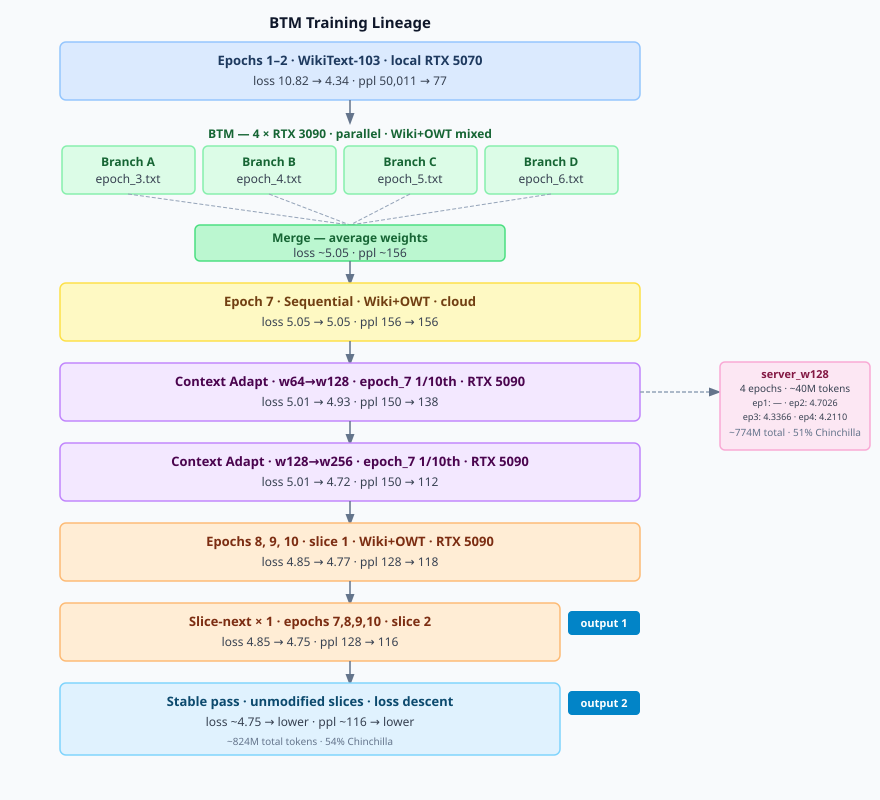
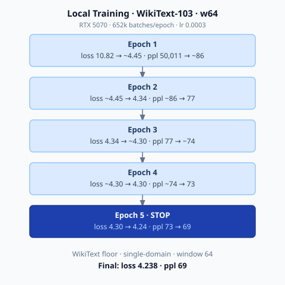

# Transformer Model Experiments - Running Notes

## Run 3 — Architecture Overhaul: Standard Pre-Norm Transformer (May 13–14, 2026)

### Architecture Changes from Run 2
- **Pre-norm** (LayerNorm before attention and FFN, not after)
- **Additive residual** (replaced non-standard concatenation residual)
- **Standard 4× FFN expansion**: d → 4d → d with GELU (was d → d)
- **head_dim = vecDims / num_heads** (was each head using full vecDims)

### Cloud Server (RTX 4090 48GB)
| Parameter | Value |
|-----------|-------|
| vecDims | 512 |
| num_heads | 8 |
| num_layers | 12 |
| window_size | 64 |
| batch_size | 700 (tuned to fill 45GB VRAM) |
| max_vocab_size | 30,000 → 50,000 (switched after initial LR experiments) |
| float_type | bfloat16 |
| Total params | 68,586,800 (30k) → 76,485,456 (50k) |
| Tokens | 104,327,545 |
| Batches/epoch | 149,040 |

### Local Machine (RTX 5070 12GB)
| Parameter | Value |
|-----------|-------|
| vecDims | 512 |
| num_layers | 8 |
| max_vocab_size | 50,000 |
| batch_size | 160 (tuned to fill 12GB VRAM) |
| Total params | ~76,000,000 |
| Batches/epoch | 652,047 |

### Parameter split: vocab vs transformer core
Vocab size dominates total parameter count. Larger vocab = more embedding + output params, fewer left for transformer layers.
Initial server config used 30k vocab; switched to 50k after LR experiments. All BTM and subsequent runs use 50k.
| | Local (50k vocab) | Server early (30k vocab) | Server later (50k vocab) |
|---|---|---|---|
| Vocab-related params | 51.2M | 30.7M | 51.2M |
| Transformer core | 24.8M (8 layers) | 37.3M (12 layers) | 24.8M (8 layers) |
| Total | ~76M | 68.6M | ~76M |

### LR Experiments (Server, Epoch 1)
| LR | Vocab | Outcome |
|----|-------|---------|
| 0.0003 | 30k | Stable, steady — loss 6.29→6.08 over first 45K batches |
| 0.0012 | 30k | Unstable — running avg oscillating 8↔9 in first 1500 batches |
| 0.0008 | 30k | Started high (6.79), flattened rapidly, ~6.33 at 50% — worse than 0.0003 baseline |
| 0.0006 | 50k | 6.53→6.44→6.36 (10/20/30%) — see vocab experiment below |

### Loss Log — Server (lr=0.0003 baseline)
| Checkpoint | Batch | Loss |
|------------|-------|------|
| 10% | 14,904 | 6.2923 |
| 20% | 29,808 | 6.1602 |
| 30% | 44,712 | 6.0834 |

### Loss Log — Server (lr=0.0008 restart)
| Checkpoint | Batch | Loss |
|------------|-------|------|
| 10% | 14,904 | 6.7883 |
| 20% | 29,808 | 6.5144 |
| 30% | 44,712 | 6.4053 |
| 40% | 59,616 | 6.3446 |
| 50% | 73,777 | 6.3250 |

### Loss Log — Server (50k vocab, lr=0.0006, batch=640, 12 layers)
| Checkpoint | Batch | Loss |
|------------|-------|------|
| 10% | 16,301 | 6.5308 |
| 20% | 32,602 | 6.4404 |
| 30% | 48,903 | 6.3554 |
| 40% | 65,204 | 6.3040 |

### Loss Log — Server (50k vocab, lr=0.0003, batch=640, 8 layers)
| Checkpoint | Batch | Loss |
|------------|-------|------|
| 10% | 16,301 | 6.2138 |
| 20% | 32,602 | 6.0775 |
| 30% | 48,903 | 6.0184 |

### Epoch Directory Index (Local)
| Epoch | Directory | Input File | Notes |
|-------|-----------|------------|-------|
| 1 | high_20260513_203905 | wikitext103.txt | WikiText-103 only; OOM mid-epoch, resumed from checkpoint |
| 2 | high_20260514_172435 | wikitext103.txt | Second pass on same corpus |
| 3 | — | epochs/epoch_3.txt | Wiki+OWT1+OWT2 mixed, offline-shuffled (seed=42), slice 1 of 8 |
| 4 | — | epochs/epoch_4.txt | Wiki+OWT1+OWT2 mixed, offline-shuffled (seed=42), slice 2 of 8 |
| 5 | — | epochs/epoch_5.txt | Wiki+OWT1+OWT2 mixed, offline-shuffled (seed=42), slice 3 of 8 |
| 6 | — | epochs/epoch_6.txt | Wiki+OWT1+OWT2 mixed, offline-shuffled (seed=42), slice 4 of 8 |
| 7 | — | epochs/epoch_7.txt | Wiki+OWT1+OWT2 mixed, offline-shuffled (seed=42), slice 5 of 8 |
| 8 | — | epochs/epoch_8.txt | Wiki+OWT1+OWT2 mixed, offline-shuffled (seed=42), slice 6 of 8 |
| 9 | — | epochs/epoch_9.txt | Wiki+OWT1+OWT2 mixed, offline-shuffled (seed=42), slice 7 of 8 |
| 10 | — | epochs/epoch_10.txt | Wiki+OWT1+OWT2 mixed, offline-shuffled (seed=42), slice 8 of 8 |

### Loss Log — Local (lr=0.0003)
| Checkpoint | Batch | Loss |
|------------|-------|------|
| 10% | 65,204 | 5.3889 |
| 20% | 130,408 | 5.0691 |
| 30% | 195,612 | 4.9001 |
| 40% | 260,816 | 4.7956 |
| 50% | 326,020 | 4.7245 |
| 60% | 391,224 | 4.6718 |
| 70% | 456,428 | 4.6314 |
| 80% | 521,632 | 4.5997 |
| 90% | 586,836 | 4.5746 |
| 100% | 652,040 | 4.5536 |
| **Epoch 1 final** | — | **4.5536** |

Note: OOM occurred during epoch 1, resumed cleanly from checkpoint.

### Loss Log — Local Epoch 2 (resumed, lr=0.0003)
| Checkpoint | Batch | Loss |
|------------|-------|------|
| 10% | 65,204 | 4.3585 |
| 20% | 130,408 | 4.3568 |
| 30% | 195,612 | 4.3540 |
| 40% | 260,816 | 4.3497 |
| 50% | 326,020 | 4.3476 |
| 60% | 391,224 | 4.3463 |
| 70% | 456,428 | 4.3451 |
| 80% | 521,632 | 4.3436 |
| 90% | 586,836 | 4.3417 |
| 100% | 652,040 | 4.3398 |
| **Epoch 2 final** | — | **4.3398** |

### Loss Log — Local Epoch 3 (lr=0.0003, input: wikitext103.txt)
| Checkpoint | Batch | Loss |
|------------|-------|------|
| 10% | 65,204 | 4.3195 |
| 20% | 130,408 | 4.3180 |
| 30% | 195,612 | 4.3174 |
| 40% | 260,816 | 4.3168 |
| 50% | 326,020 | 4.3163 |
| 60% | 391,224 | 4.3157 |
| 70% | 456,428 | 4.3150 |
| 80% | 521,632 | 4.3142 |
| 90% | 586,836 | 4.3134 |
| 100% | 652,040 | 4.3126 |
| **Epoch 3 final** | — | **4.3126** |

### Loss Log — Local Epoch 4 (lr=0.0003, input: wikitext103.txt)
| Checkpoint | Batch | Loss |
|------------|-------|------|
| 10% | 65,204 | 4.3032 |
| 20% | 130,408 | 4.3027 |
| 30% | 195,612 | 4.3019 |
| 40% | 260,816 | 4.3011 |
| 50% | 326,020 | 4.3003 |
| 60% | 391,224 | 4.2996 |
| 70% | 456,428 | 4.2989 |
| 80% | 521,632 | 4.2982 |
| 90% | 586,836 | 4.2975 |
| 100% | 652,040 | 4.2968 |
| **Epoch 4 final** | — | **4.2968** |

### Loss Log — Local Epoch 5 (lr=0.0003, input: wikitext103.txt, in progress)
| Checkpoint | Batch | Loss |
|------------|-------|------|
| 10% | 65,204 | 4.2407 |
| 20% | 130,408 | 4.2392 |
| 30% | 195,612 | 4.2386 |
| 40% | 260,816 | 4.2383 |
| 50% | 326,020 | 4.2381 |
| 60% | 391,224 | 4.2380 |

### BTM Round 1 — Branch-Train-Merge (May 2026)

**Setup**
- Starting checkpoint: epoch 2 local model (WikiText-103, loss ~4.35)
- 4 Vast.ai RTX 3090 (24GB) machines, each training on one epoch slice
- Data per branch: Wiki+OWT1+OWT2 mixed, offline-shuffled (seed=42)
- Merge tool: `merge_checkpoints.py` — averages weights, resets optimizer state

**Branch assignments**
| Branch | Data slice |
|--------|------------|
| A | epoch_3.txt |
| B | epoch_4.txt |
| C | epoch_5.txt |
| D | epoch_6.txt |

**Config (all branches)**
| Parameter | Value |
|-----------|-------|
| vecDims | 512 |
| num_heads | 8 |
| num_layers | 8 |
| window_size | 64 |
| batch_size | 160 |
| lr | 0.0003 |
| float_type | bfloat16 |
| max_vocab_size | 50,000 |

**Command**
```
python runner.py runs.toml btm --epochs 3 --cache_file raw_data/data.cache
```

**Loss log — branch training (new distribution: Wiki+OWT)**
| Branch | Data slice | 10% loss | Notes |
|--------|------------|----------|-------|
| A | epoch_3.txt | 6.7706 | |
| B | epoch_4.txt | 6.7381 | |
| C | epoch_5.txt | 6.7159 | |
| D | epoch_6.txt | 6.7500 | machine died, restarted; first data point delayed |

### Loss Log — Sequential Post-BTM (epoch_7.txt through epoch_10.txt, lr=0.0003)
Starting from merged_btm_round1.pth

| Epoch | Checkpoint | Batch | Loss |
|-------|------------|-------|------|
| 7 | 10% | 65,131 | 5.4560 |
| 7 | 20% | 130,262 | 5.2921 |
| 7 | 30% | 195,393 | 5.2135 |
| 7 | 40% | 260,524 | 5.1652 |
| 7 | 50% | 325,655 | 5.1321 |
| 7 | 60% | 390,786 | 5.1076 |
| 7 | 70% | 455,917 | 5.0891 |
| 7 | 80% | 521,048 | 5.0745 |
| 7 | 90% | 586,179 | 5.0627 |
| 7 | 100% | 651,310 | 5.0533 |
| **7 final** | — | — | **5.0533** |

---

### Sliding-slice strategy for long runs (May 17, 2026)

Motivation: 5090 rental has ~24 hours remaining. A full epoch at w256 takes ~1800 min; 1/10th slices take ~180 min each, allowing multiple cycles of all four data files within the rental window.

input_list cycles through: epoch_7_adapt.txt, epoch_8.txt, epoch_9.txt, epoch_10.txt
Each file is 1/10th of its original (~51–54MB, ~54k–79k batches at w256).
epoch_7_adapt.txt (and epoch_8/9/10 slices) are manually advanced to the next 10% slice each time the run loops back, so every cycle sees different content.

| Cycle | epoch_7_adapt slice |
|-------|-------------------|
| 1 | lines 1 – 10% |
| 2 | lines 10% – 20% |
| 3 | lines 20% – 30% |
| … | … |

Cache for each file is deleted each time its slice is rotated so it rebuilds against the new content.

The sliding window on smaller slices is our own practical approach to fit meaningful training cycles within the rental window. Similar ideas may exist in curriculum learning and data-streaming literature — to be read further.

**Potentially related references (to read)**
| Topic | Paper | Authors | Year |
|-------|-------|---------|------|
| Ordered data subsets during training | Curriculum Learning | Bengio et al. | 2009 |
| Training on data shards without full-epoch passes | Language Models are Few-Shot Learners (GPT-3) | Brown et al., OpenAI | 2020 |

---

### Context Extension — w128 (May 17, 2026)

**Setup**
| Parameter | Value |
|-----------|-------|
| Starting checkpoint | merged_btm_round1_plus_epoch7.pth (loss 5.0533, w64) |
| posEmbedding | interpolated 64→128 via extend_context.py |
| Machine | RTX 3090 24GB (epoch6 machine) |
| window_size | 128 |
| batch_size | 160 |
| lr | 0.00003 |
| float_type | bfloat16 |
| Adam eps | 1e-4 (bfloat16 stability) |
| grad_clip | 1.0 |

**Loss Log — 3090 (epoch_7.txt)**
| Checkpoint | Batch | Loss |
|------------|-------|------|
| 0.4% | — | 4.9427 |
| 2.2% | 14,024 | 4.9322 |
| 3.3% | — | 4.9300 |

---

### Context Extension — w128 adapt run (May 17, 2026)

**Setup**
| Parameter | Value |
|-----------|-------|
| Starting checkpoint | model_epoch7_sequential_w128.pth (posEmbedding interpolated 64→128) |
| Machine | RTX 5090 32GB |
| Input | epoch_7_adapt.txt (first 10% of epoch_7.txt, ~54M tokens) |
| input_list | epoch_7_adapt.txt, epoch_8.txt, epoch_9.txt, epoch_10.txt |
| window_size | 128 |
| batch_size | 192 |
| lr | 0.00003 |
| float_type | bfloat16 |

**Loss Log — 5090 (epoch_7_adapt.txt, 54,184 batches total)**
| Checkpoint | Batch | Loss |
|------------|-------|------|
| 10% | 5,418 | 4.9354 |
| 20% | 10,836 | 4.9307 |
| 30% | 16,254 | 4.9291 |
| 40% | 21,672 | 4.9281 |
| 50% | 27,090 | 4.9274 |
| 60% | 32,508 | 4.9270 |
| 70% | 37,926 | 4.9266 |
| 80% | 43,344 | 4.9263 |
| 90% | 48,762 | 4.9260 |
| 100% | 54,180 | 4.9257 |
| **Epoch final** | — | **4.9257** |

---

### Context Extension — w256 adapt run (May 17, 2026)

**Setup**
| Parameter | Value |
|-----------|-------|
| Starting checkpoint | model_epoch7_sequential_w128_adapted.pth (loss 4.9257, w128) |
| posEmbedding | interpolated 128→256 via extend_context.py |
| Machine | RTX 5090 32GB |
| Input | epoch_7_adapt.txt → epoch_8.txt → epoch_9.txt → epoch_10.txt |
| window_size | 256 |
| batch_size | 192 |
| lr | 0.00003 |
| float_type | bfloat16 |

**Loss Log — 5090 (epoch_7_adapt.txt, 78,812 batches total)**
| Checkpoint | Batch | Loss |
|------------|-------|------|
| 10% | 7,881 | 4.9022 |
| 20% | 15,762 | 4.8338 |
| 30% | 23,643 | 4.8018 |
| 40% | 31,524 | 4.7813 |
| 50% | 39,405 | 4.7664 |
| 60% | 47,286 | 4.7548 |
| 70% | 55,167 | 4.7451 |
| 80% | 63,048 | 4.7369 |
| 90% | 70,929 | 4.7298 |
| 100% | 78,810 | 4.7235 |
| **Epoch final** | — | **4.7235** |

**Loss Log — 5090 (epoch_8 slice 1, 78,087 batches)**
| Checkpoint | Batch | Loss |
|------------|-------|------|
| 10% | 7,808 | 4.8519 |
| 20% | 15,616 | 4.8306 |
| 30% | 23,424 | 4.8166 |
| 40% | 31,232 | 4.8057 |
| 50% | 39,040 | 4.7969 |
| 60% | 46,848 | 4.7895 |
| 70% | 54,656 | 4.7830 |
| 80% | 62,464 | 4.7772 |
| 90% | 70,272 | 4.7718 |
| **Epoch final** | — | **4.7670** |

Each new data slice causes a brief uptick at the start as the model adjusts to new content, then resumes descent — this is expected and consistent across all slice transitions.

**Loss Log — 5090 (epoch_9 slice 1, 78,174 batches)**
| Checkpoint | Batch | Loss |
|------------|-------|------|
| 10% | 7,817 | 4.8442 |
| 20% | 15,634 | 4.8245 |
| 30% | 23,451 | 4.8118 |
| 40% | 31,268 | 4.8022 |
| 50% | 39,085 | 4.7945 |
| 60% | 46,902 | 4.7877 |
| 70% | 54,719 | 4.7819 |
| 80% | 62,536 | 4.7765 |
| 90% | 70,353 | 4.7718 |
| **Epoch final** | — | **4.7674** |

**Loss Log — 5090 (epoch_10 slice 1, 78,269 batches)**
| Checkpoint | Batch | Loss |
|------------|-------|------|
| 10% | 7,826 | 4.8438 |
| 20% | 15,652 | 4.8254 |
| 30% | 23,478 | 4.8136 |
| 40% | 31,304 | 4.8046 |
| 50% | 39,130 | 4.7971 |
| 60% | 46,956 | 4.7908 |
| 70% | 54,782 | 4.7852 |
| 80% | 62,608 | 4.7803 |
| 90% | 70,434 | 4.7758 |
| **Epoch final** | — | **4.7717** |

**Loss Log — 5090 (epoch_7_adapt slice 2, 2nd loop, 78,784 batches)**
| Checkpoint | Batch | Loss |
|------------|-------|------|
| 10% | 7,878 | 4.8219 |
| 20% | 15,756 | 4.8043 |
| 30% | 23,634 | 4.7929 |
| 40% | 31,512 | 4.7844 |
| 50% | 39,390 | 4.7774 |
| 60% | 47,268 | 4.7715 |
| 70% | 55,146 | 4.7662 |
| 80% | 63,024 | 4.7616 |
| 90% | 70,902 | 4.7574 |
| **Epoch final** | — | **4.7535** |

**Loss Log — 5090 (epoch_8 slice 2, 2nd loop, 78,895 batches, in progress)**
| Checkpoint | Batch | Loss |
|------------|-------|------|
| 10% | 7,889 | 4.8352 |
| 20% | 15,778 | 4.8183 |
| 30% | 23,667 | 4.8073 |
| 40% | 31,556 | 4.7990 |
| 50% | 39,445 | 4.7923 |
| 60% | 47,334 | 4.7865 |

---

### Bug fix — vocab mismatch in runner.py / DataInput.py (May 17, 2026)

**Symptoms**
- 5090 runs showed loss ~8–12 at early batches vs expected ~4.9

**Root cause**
- `runner.py` set `vocab_file` to run dir path but never copied `vocab.json` there
- `DataInput.py` found file missing → rebuilt vocab from training data slice → different word→index mapping from model's training vocab
- On cache load, `DataInput.py` used vocab embedded in cache, ignoring `vocab_file` entirely

**Fix**
- `runner.py`: copies root `vocab.json` into run dir before training starts (`shutil.copy2`)
- `DataInput.py`: on cache load, prefers `vocab_file` over cache-embedded vocab when `vocab_file` is set

**BTM/sequential lineage confirmed unaffected** — 3090 runs maintained vocab consistency through cache across all epochs

---

### Vocab Size Experiment (Server, 50k vocab, lr=0.0006, batch=640)
Restarted server with 50k vocab to match local and isolate whether vocab was contributing to local's better convergence.

| | Baseline (random) | Loss at 10% | Gap closed |
|---|---|---|---|
| Server (30k, lr=0.0003) | 10.30 | 6.29 | 59.0% |
| Server (50k, lr=0.0006) | 10.82 | 6.53 | 58.6% |
| Local  (50k, lr=0.0003) | 10.82 | 5.39 | 74.2% |

Server with 50k vocab and higher LR landed at virtually the same relative position as the original 30k run (58.6% vs 59%). Vocab size appears to have minimal impact on convergence rate. A subsequent experiment (server, 8 layers, batch=640, lr=0.0003) showed noticeably faster descent than the 12-layer run at the same batch size:

| | 10% | 20% | 30% | drop (10→20%) |
|---|---|---|---|---|
| Server 12L (lr=0.0006) | 6.5308 | 6.4404 | 6.3554 | -0.090 |
| Server  8L (lr=0.0003) | 6.2138 | 6.0775 | 6.0184 | -0.136 |
| Local   8L (lr=0.0003) | 5.3889 | 5.0691 | 4.9001 | -0.320 |

Layer depth appears to be a contributing factor alongside batch size — both variables affect early convergence rate. Local's advantage is still primarily gradient steps (4× more updates/epoch), but the 12-layer depth was adding an additional drag. More epochs needed before firm conclusions on final loss floor.

### Key Insight: Batch Size vs Gradient Steps
| | Local | Server |
|---|---|---|
| Batch size | 160 | 700 |
| Updates/epoch | 652,047 | 149,040 |
| Loss at ~50% epoch 1 | 4.72 | 6.33 |

Local is ahead in loss at the same wall-clock time (loss ~4.64 vs ~6.1 at 820 mins), but the gap is smaller than the gradient-step count alone suggests — server epochs complete in ~820 mins vs local's ~1235 mins, so the server partially compensates with faster epoch turnaround. The gradient step count (4.4× more on local) explains the loss gap; the faster server epoch time partially closes the wall-clock gap. Estimated wall-clock to loss=3.5: local ~12,350 mins (10 epochs), server ~16,400 mins (20 epochs) — local ~25% faster, not dramatically so. The 5070 at batch=160 appears better matched to this model size than the 4090 at batch=700.

Possible directions to explore (not yet experimented):
- Reduce server batch to ~256 to get more gradient steps while accepting lower VRAM utilisation
- MPS (Multi-Process Service) — allows multiple processes to share one GPU concurrently; unclear if this helps training convergence
- DDP (DistributedDataParallel) across multiple GPUs — each GPU handles a smaller batch, gradients averaged before update; could give both utilisation and gradient steps, but requires multi-GPU setup

### Critical Batch Size — Theoretical Shape
Convergence speed (loss drop per wall-clock time) vs batch size follows three regimes:

```
convergence
speed          ╭───────╮
               │       ╰──────────────
             ╭─╯
           ╭─╯
───────────╯
           1        Bs              N
                critical batch
```

- **Batch 1 → Bs:** noise-limited regime. Doubling batch ≈ halves steps needed — wall-clock convergence stays roughly constant. LR scaling keeps you here.
- **Around Bs:** peak efficiency — GPU well-utilised, gradient estimates accurate enough, update frequency still high.
- **Bs → N:** curvature-limited regime. Gradients are already accurate enough; larger batches buy less convergence per unit compute. Diminishing returns.

In our runs, batch=160 (local) converged faster than batch=640–700 (server) at the same wall-clock time, consistent with the server batch being in the diminishing returns regime.

**Reference:** "An Empirical Model of Large-Batch Training" — McCandlish et al., OpenAI, 2018.

### Scale: This Run vs. Production

| | Local (this run) | LLaMA 3 |
|---|---|---|
| GPUs | 1× RTX 5070 | 16,000× H100 |
| VRAM | 12 GB | 1,280,000 GB |
| Params | 76M | 405B |
| Tokens trained | ~400M | 15T |
| Estimated cost | electricity | ~$50M |

Chinchilla-optimal tokens for 76M params: ~1.5B. This run reaches ~400M (27% of optimal).
The training loop is identical.

### Learnings
Discovered that large batch sizes mean fewer gradient steps per epoch, which slows convergence. One approach tried was scaling LR proportionally with batch size (`lr = base_lr × batch/reference_batch`), but experiments showed this alone did not close the gap — gradient step count remains the dominant factor. Tuning LR by watching live loss turned out to be unreliable and noisy; the standard approach for transformers is warmup + cosine decay. The original transformer paper (2017) includes warmup, and BERT and GPT-2 also use LR warmup. PyTorch's `CosineAnnealingLR` decays LR using `lr = eta_min + 0.5 × (lr_max - eta_min) × (1 + cos(π × t / T_max))`. Next experiment: properly implement LR scaling with warmup + cosine decay and measure impact.

### Training Diagrams

**BTM Lineage**


**Local WikiText-103 Run**


### Training Data Volume — BTM Lineage

† Epochs 3–6 ran in parallel on 4 separate machines; each branch saw one unique epoch file before weight-averaging at merge. Adapt slices are subsets of epoch_7 already seen in full during the sequential epoch — no new unique content. Stable pass repeats the same slices as slice-next — no new unique content.

| Net Epoch | Step | Domain | New unique data | Cumul. unique | End Loss |
|----------:|------|--------|----------------:|--------------:|--------:|
| 1 | WikiText-103 | wiki | 515 MB | 515 MB | ~4.45 |
| 2 | WikiText-103 (repeat) | wiki | — | 515 MB | 4.34 |
| 3 † | BTM Branch A — epoch_3 | wiki+owt | 513 MB | 1.03 GB | — |
| 4 † | BTM Branch B — epoch_4 | wiki+owt | 513 MB | 1.54 GB | — |
| 5 † | BTM Branch C — epoch_5 | wiki+owt | 513 MB | 2.05 GB | — |
| 6 † | BTM Branch D — epoch_6 · **merge** | wiki+owt | 512 MB | 2.56 GB | ~5.05 |
| 7 | Epoch 7 sequential | wiki+owt | 514 MB | 3.07 GB | 5.05 |
| 7.1 | w64→w128 adapt · epoch_7 1/10th (repeat) | wiki+owt | — | 3.07 GB | 4.93 |
| 7.2 | w128→w256 adapt · epoch_7 1/10th (repeat) | wiki+owt | — | 3.07 GB | 4.72 |
| 7.3 | Epoch 8 slice 1 | wiki+owt | ~51 MB | 3.12 GB | 4.77 |
| 7.4 | Epoch 9 slice 1 | wiki+owt | ~51 MB | 3.17 GB | 4.77 |
| 7.5 | Epoch 10 slice 1 | wiki+owt | ~51 MB | 3.22 GB | 4.77 |
| 7.9 | Slice-next ×1 · ep 8,9,10 slice 2 — **output 1** | wiki+owt | ~153 MB | 3.37 GB | ~4.75 |
| 8.3 | Stable pass · same slices (repeat) | wiki+owt | — | 3.37 GB | lower — **output 2** |

### Training Data Volume — Local WikiText-103

| Net Epoch | Step | Domain | New unique data | Cumul. unique | End Loss |
|----------:|------|--------|----------------:|--------------:|--------:|
| 1 | WikiText-103 | wiki | 515 MB | 515 MB | ~4.45 |
| 2–5 | WikiText-103 (repeats) | wiki | — | 515 MB | 4.24 |

### Comparison Summary

| | Local wiki | BTM lineage (output 2) |
|---|---|---|
| Net epochs | 5 | ~8.3 |
| Unique data seen | 515 MB (wiki only) | ~3.37 GB (wiki+owt) |
| Passes over data | 5 | varies (1–2 per file) |
| End loss | 4.24 | ~4.7+ |
| End ppl | 69 | ~117 |
| Domain | single | mixed |

The BTM model has seen ~6.5× more unique data across a broader domain.

### Validation Strategy (May 18, 2026)

Four models will be evaluated:
1. **local_epoch5** — WikiText-103 only, w64, loss ~4.238 (floor of single-domain training)
2. **local_epoch5_w128** — positional interpolation 64→128, adapted on 1/10th of WikiText-103
3. **local_epoch5_w256** — positional interpolation 128→256, adapted on 1/10th of WikiText-103
4. **server_w256_pre_stable** — BTM lineage, w256, before final stable-data pass (sliding-slice endpoint)
5. **server_w256_post_stable** — same lineage, after one full pass on unmodified data slices (expected lower loss)

Four validation datasets, all held out from training:

| Dataset | File | Lines | Size | Purpose |
|---------|------|-------|------|---------|
| WikiText-103 held-out | `val_wiki.txt` | 29,259 | 13MB | In-domain (same source as local training) |
| OpenWebText held-out | `val_owt.txt` | 29,259 | 3.6MB | In-domain (same source as server training) |
| Wiki 50% + OWT 50% | `val_mixed.txt` | 29,258 | 8.3MB | Mixed-domain coverage |
| LAMBADA (OpenAI test set) | `val_lambada.txt` | 5,153 | 1.7MB | Out-of-domain; tests long-range next-word prediction |

LAMBADA is a standard LM benchmark entirely independent of both training sources. Each passage requires broader context to predict the final word correctly, making it a useful probe of how well the model generalises beyond its training distribution.

All four files live in `raw_data/`. Trainer.py validation mode (to be added) will run a forward pass over the given file and report cross-entropy loss — no training, no gradient updates.

### Key References
| Topic | Paper | Authors | Year |
|-------|-------|---------|------|
| Warmup + inverse sqrt decay | Attention Is All You Need | Vaswani et al. | 2017 |
| Cosine annealing | SGDR: SGD with Warm Restarts | Loshchilov & Hutter | 2017 |
| Warmup + cosine popularized | Bag of Tricks for Image Classification | He et al. | 2018 |
| Transformer standard (warmup+cosine) | BERT | Devlin et al. | 2019 |
| Transformer standard (warmup+cosine) | GPT-2 | Radford et al. | 2019 |
| LR Range Test | Cyclical Learning Rates for Training Neural Networks | Leslie Smith | 2017 |
| Critical batch size | An Empirical Model of Large-Batch Training | McCandlish et al., OpenAI | 2018 |
| Loss scaling with model size/depth | Scaling Laws for Neural Language Models | Kaplan et al., OpenAI | 2020 |
| Pre-LN vs Post-LN training stability | On Layer Normalization in the Transformer Architecture | Xiong et al. | 2020 |
| Compute-optimal training (tokens per param) | Training Compute-Optimal Large Language Models | Hoffmann et al., DeepMind | 2022 |
| Progressive context extension via positional interpolation | Extending Context Window of Large Language Models via Positional Interpolation | Chen et al., Meta | 2023 |
| Federated averaging of model weights | Communication-Efficient Learning of Deep Networks from Decentralized Data (FedAvg) | McMahan et al., Google | 2017 |
| Weight averaging improves generalization | Model Soups: Averaging Weights of Fine-tuned Models Improves Accuracy | Wortsman et al. | 2022 |
| Parallel training on data slices + merge | Branch-Train-Merge: Embarrassingly Parallel Training of Expert Language Models | Li et al., Meta | 2022 |

---

## Run 2 — WikiText-103 (50MB), Learned Embedding (May 12, 2026)

### Hyperparameters
- Embedding: Learned (nn.Embedding, vecDims=128)
- Data: raw_data/wikitext50m.txt (50MB slice of WikiText-103)
- Vocabulary: 30,000 (capped from 148,535 unique tokens)
- Layers: 6 | Heads: 8 | Window: 64 | Batch: 192
- LR: 0.0003 | Schedule: Plateau | Optimizer: Adam
- Model Parameters: 11,062,832

### Timing
- ~1hr 28min per epoch (50,407 batches at 9.2 batch/s on RTX 5070)
- vs Run 1: ~25 min/epoch — 3.5× slower despite only 1.8× more parameters
- Slowdown mainly due to larger dataset (wikitext50m >> combined.txt) — more tokens = more batches per epoch

### Loss Log
| Epoch | Loss | Notes |
|-------|------|-------|
| 1 | 4.4123 | |
| 2 | 3.9514 | |
| 3 | 3.8389 | |
| 4 | 3.7725 | |
| 5 | 3.7239 | |
| 6 | — | CUDA launch timeout (X11 watchdog, display on same GPU) |
| 7+ | resumed | Resumed from epoch 5 checkpoint with --start_epoch 7 |

---

## Run 1 — combined.txt, GloVe Embedding

## Experiment Overview
- **Date**: May 11, 2026
- **Model**: Custom Transformer with Multi-Head Attention
- **Embedding**: GloVe fixed embedding (100-dim)
- **Positional Encoding**: Unconventional approach - position kept in dimension 101 (diverging from original sinusoidal positional embedding)
- **Vocabulary Size**: 50,020 tokens
- **Vector Space Dimension**: 100

## Hyperparameters
- Number of Attention Heads: 8
- Number of Transformer Layers: 3
- Window Size (Context Length): 64
- Batch Size: 128
- Epochs Planned: 100
- Learning Rate: 0.0003
- Optimizer: Adam
- Learning Rate Schedule: Plateau (patience=5, factor=0.5)
- Output Type: Indices (CrossEntropy Loss)
- Input Data: raw_data/combined.txt
- Model Checkpoint: transformer_model.pth

## Model Architecture
- Total Parameters: 6,143,451
- Trainable Parameters: 6,143,451
- Embedding Layer: Fixed GloVe vectors (non-trainable)
- Position Handling: Custom implementation in dimension 101
- Attention Mechanism: Multi-Head Self-Attention
- Feed Forward Network: Standard transformer FFN

## Training Progress
Training was interrupted manually at epoch 54. Loss values recorded:

| Epoch | Loss |
|-------|------|
| 1 | 4.4696 |
| 2 | 3.9660 |
| 3 | 3.8387 |
| 4 | 3.7737 |
| 5 | 3.7321 |
| 6 | 3.7025 |
| 7 | 3.6800 |
| 8 | 3.6622 |
| 9 | 3.6476 |
| 10 | 3.6354 |
| 11 | 3.6250 |
| 12 | 3.6159 |
| 13 | 3.6080 |
| 14 | 3.6010 |
| 15 | 3.5948 |
| 16 | 3.5892 |
| 17 | 3.5841 |
| 18 | 3.5795 |
| 19 | 3.5753 |
| 20 | 3.5713 |
| 21 | 3.5677 |
| 22 | 3.5644 |
| 23 | 3.5613 |
| 24 | 3.5583 |
| 25 | 3.5556 |
| 26 | 3.5531 |
| 27 | 3.5506 |
| 28 | 3.5483 |
| 29 | 3.5461 |
| 30 | 3.5441 |
| 31 | 3.5421 |
| 32 | 3.5403 |
| 33 | 3.5384 |
| 34 | 3.5368 |
| 35 | 3.5351 |
| 36 | 3.5336 |
| 37 | 3.5321 |
| 38 | 3.5306 |
| 39 | 3.5293 |
| 40 | 3.5279 |
| 41 | 3.5267 |
| 42 | 3.5254 |
| 43 | 3.5243 |
| 44 | 3.5230 |
| 45 | 3.5220 |
| 46 | 3.5209 |
| 47 | 3.5199 |
| 48 | 3.5189 |
| 49 | 3.5179 |
| 50 | 3.5170 |
| 51 | 3.5161 |
| 52 | 3.5152 |
| 53 | 3.5143 |
| 54 | 3.5135 (interrupted) |

### Observations from Training Curve
- Steady, consistent decrease in loss throughout training
- Learning rate remained constant at 0.0003 throughout recorded epochs (plateau scheduler didn't trigger)
- Loss reduction appears to be slowing down as training progresses (asymptotic behavior)
- After 54 epochs, loss ~3.51, suggesting model has learned meaningful patterns but could benefit from more training

## Inference Examples
### Example 1
**Input Context** (63 tokens):
```
how are you today? I met the governor yesterday and the prime minister the day before. they are very happy with the elections
```

**Generated Continuation**:
```
how are you today ? i met the governor yesterday and the prime minister the day before . they are very happy with the elections , and the duke hears the massachusetts ’ s swain , and the snake and hank swim around the duke floundered in the river . temperance tribe , whooping and a crick ’ s , and a mighty big lot , and a big stack of matches , and a
```


### Positional Encoding
Run 1 used a custom approach — position stored in dimension 101 of the GloVe vector. Current implementation (Run 3) uses learned positional embeddings via `nn.Embedding(window_size, vecDims)`, which is the GPT-style approach. The original transformer paper used sinusoidal encodings; both sinusoidal and learned are standard choices.